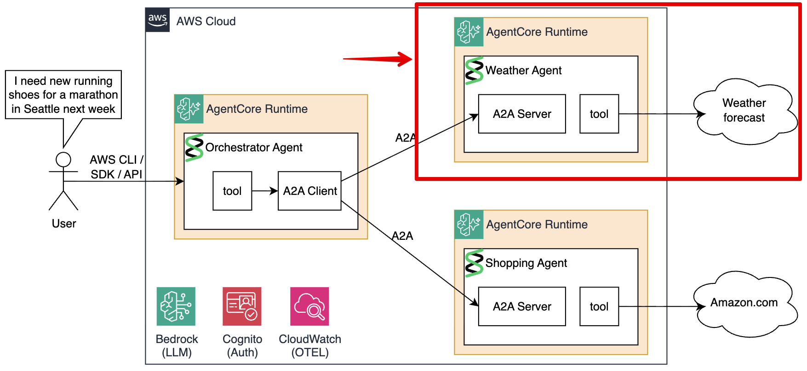

# Module 3: Weather Agent

In this module you will learn about, build, deploy, and test the Weather Agent.



## Understanding the Code

Open [`agents/weather/main.py`](agents/weather/main.py). The Weather Agent is a Strands agent with one tool — `internet_search` — that queries DuckDuckGo for live weather data:

```python
@tool
async def internet_search(keywords: str, max_results: int = 3) -> str:
    """Search the internet for current information."""
    results = await asyncio.wait_for(
        asyncio.to_thread(lambda: DDGS().text(keywords, region="us-en", max_results=max_results)),
        timeout=8.0
    )
    # format results and return as text
```

The `@tool` decorator exposes this function to the Strands `Agent`. When a user asks about weather, the LLM decides when to call `internet_search` and with what keywords.

The agent is configured with a focused system prompt:

```python
system_prompt = """You are a Weather Assistant. Answer weather-related questions
by searching the internet for current conditions, forecasts, and weather events.
Always return concise answer in format "The weather in {location} is {temperature}. It is {conditions}"
"""

agent = Agent(system_prompt=system_prompt, tools=[internet_search], name="Weather Agent")
```

**Serving the agent via A2A:**

The Strands `A2AServer` wraps the agent and exposes it as an A2A-compliant HTTP server. `serve_at_root=True` mounts the A2A endpoints at `/` instead of `/a2a`:

```python
a2a_server = A2AServer(
    agent=agent,
    http_url=runtime_url,   # the public URL — embedded in the agent card
    serve_at_root=True,
)

app = FastAPI()
app.get("/ping")(lambda: {"status": "healthy"})   # health check
app.mount("/", a2a_server.to_fastapi_app())        # A2A at root
```

`A2AServer` automatically registers:
- `GET /.well-known/agent-card.json` — agent discovery
- `POST /` — handles `message/send` JSON-RPC requests

The agent runs on port 9000 via uvicorn:
```python
if __name__ == "__main__":
    uvicorn.run(app, host="0.0.0.0", port=9000)
```

**The Dockerfile** builds for linux/arm64, installs dependencies with `uv`, and starts uvicorn with OpenTelemetry auto-instrumentation:

```dockerfile
FROM ghcr.io/astral-sh/uv:python3.13-bookworm-slim
COPY pyproject.toml uv.lock ./
RUN uv sync --frozen --no-cache
COPY main.py ./
CMD ["uv", "run", "opentelemetry-instrument", "uvicorn", "main:app", "--host", "0.0.0.0", "--port", "9000"]
```

## Build and Push to ECR

```bash
make build-and-push-weather-agent
```

This builds the linux/arm64 image and pushes it to the `a2a-workshop-weather-agent` ECR repository.

## Deploy to AgentCore

Uncomment the `weather_agent` module in `terraform/workshop.tf`:

```hcl
module "weather_agent" {
  source                = "./weather-agent"
  project_name          = local.project_name
  region                = data.aws_region.current.region
  ecr_repo_prefix       = local.project_name_short
  cognito_client_id     = module.cognito.client_id
  cognito_discovery_url = module.cognito.discovery_url
}
```

Then apply:

```bash
make deploy-infra
```

Terraform creates:
- An **IAM role** allowing AgentCore to pull from ECR, invoke Bedrock, and write CloudWatch/X-Ray
- An **AgentCore runtime** referencing the ECR image by digest (not `:latest` tag — immutable)
- A **JWT authorizer** validating Cognito tokens: only callers with a valid `resource/read` token can invoke this agent
- A **CloudWatch log group** at `/aws/vendedlogs/agentcore/weather-agent/applogs` with log delivery

The key Terraform block for the runtime:

```hcl
resource "aws_bedrockagentcore_agent_runtime" "weather_agent" {
  agent_runtime_artifact {
    container_configuration {
      container_uri = local.weather_agent_ecr_uri   # image@sha256:<digest>
    }
  }
  authorizer_configuration {
    custom_jwt_authorizer {
      discovery_url   = var.cognito_discovery_url   # Cognito OIDC discovery endpoint
      allowed_clients = [var.cognito_client_id]     # only our app client can call
    }
  }
  protocol_configuration {
    server_protocol = "A2A"   # AgentCore routes A2A JSON-RPC to the container
  }
}
```

The runtime URL is saved to `./tmp/weather_agent_runtime_url.txt`.

## Test

Get a Cognito bearer token first:

```bash
make get-cognito-access-token
```

This posts `client_credentials` to the Cognito token endpoint and saves the token to `./tmp/access_token.txt`.

Now test the Weather Agent:

```bash
make test-weather-agent
```

**Part 1 — Agent card retrieval:**

Expected response:

```json
{
  "name": "Weather Agent",
  "description": "An agent that answers weather questions using live internet search.",
  "url": "https://bedrock-agentcore.<region>.amazonaws.com/.../invocations/",
  ...
}
```

**Part 2 — A2A message** (`"What is the weather in Seattle?"`):

The agent calls `internet_search`, LLM formats the result, and the response arrives as A2A artifacts:

```json
{
  "artifactId": "d20b2357-e0b1-4b68-82d3-c9e35cb4dd2f",
  "name": "agent_response",
  "parts": [
    {
      "kind": "text",
      "text": "The weather in Seattle is 58°F. It is partly cloudy with a chance of rain."
    }
  ]
}
```

## Next Step

[Continue to Module 4 - Setting up the Shopping Agent](04-shopping-agent.md)

## Workshop Table Of Contents

1. [Overview](README.md) - Overview, architecture, understanding the protocols.
1. [Prerequisites & Setup](02-prereqs.md) — Install dependencies, QEMU, bootstrap infrastructure, deploy Cognito
2. [Weather Agent](03-weather-agent.md) — Build, deploy, and test the Weather sub-agent
3. [Shopping Agent](04-shopping-agent.md) — Build, deploy, and test the Shopping sub-agent
4. [Orchestrator Agent](05-orchestrator-agent.md) — Build, deploy, and test the Orchestrator + observability & troubleshooting
5. [Cleanup](06-cleanup.md) — Destroy all AWS resources