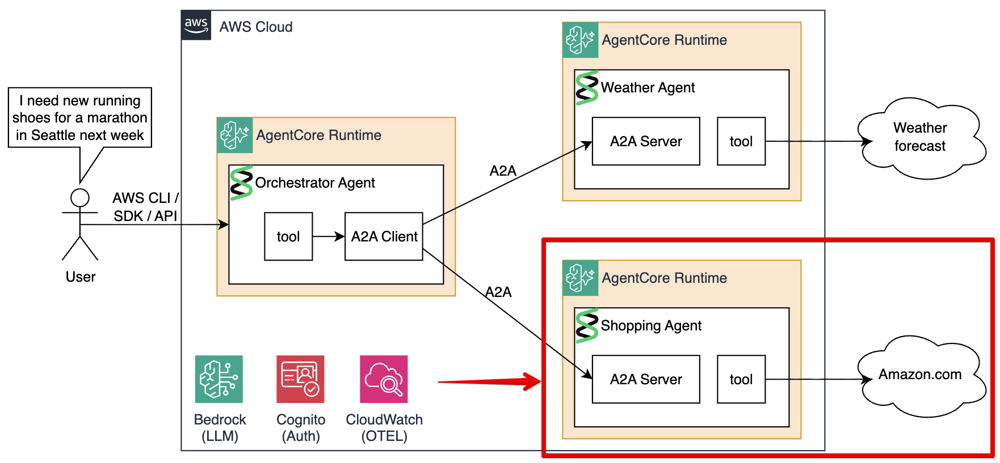

# Module 4: Shopping Agent

In this step you will learn about, build, deploy, and test the Shopping Agent.



## Understanding the Code

Open [`agents/shopping/main.py`](agents/shopping/main.py). The Shopping Agent follows the same pattern as the Weather Agent. Its tool `search_amazon` prefixes queries with `site:amazon.com` to return product results with titles and links:

```python
@tool
async def search_amazon(query: str, max_results: int = 5) -> str:
    """Search Amazon for clothing and apparel products."""
    results = await asyncio.wait_for(
        asyncio.to_thread(lambda: DDGS().text(f"site:amazon.com {query}", region="us-en", max_results=max_results)),
        timeout=8.0
    )
    # format as numbered list with title, description, and Amazon URL
```

The system prompt focuses Claude on mapping weather conditions to specific clothing categories:

```python
system_prompt = """You are a Shopping Assistant specializing in weather-appropriate clothing.
Examples of weather-to-apparel mapping:
- Cold + snow → insulated waterproof jacket, thermal base layer, snow boots
- Hot + sunny → lightweight breathable shirt, UV-protection hat, shorts
- Rain + mild → rain jacket, waterproof shoes
"""
```

The server setup is identical to the Weather Agent — `A2AServer` + FastAPI + `/ping` health check on port 9000.

## Build and Push to ECR

```bash
make build-and-push-shopping-agent
```

## Deploy to AgentCore

Uncomment the `shopping_agent` module in `terraform/workshop.tf`:

```hcl
module "shopping_agent" {
  source                = "./shopping-agent"
  project_name          = local.project_name
  region                = data.aws_region.current.region
  ecr_repo_prefix       = local.project_name_short
  cognito_client_id     = module.cognito.client_id
  cognito_discovery_url = module.cognito.discovery_url
}
```

Then apply:

```bash
make deploy-infra
```

Same infrastructure as the Weather Agent: IAM role, AgentCore runtime with A2A + JWT auth, CloudWatch log delivery. Runtime URL saved to `./tmp/shopping_agent_runtime_url.txt`.

## Test

```bash
make test-shopping-agent
```

Sends the message `"It is raining in Seattle. What should I wear?"` as an A2A request and displays the agent card and product recommendations:

```json
{
  "artifactId": "9c0a143e-9ab0-4f5f-b603-9f6dd886ddfb",
  "name": "agent_response",
  "parts": [
    {
      "kind": "text",
      "text": "## Rainy Seattle Weather - What to Wear\n\n### 1. Waterproof Rain Jacket\n- Outdoor Ventures Men's Waterproof Rain Jacket\n  https://www.amazon.com/...\n\n### 2. Waterproof Rain Boots\n- Men's Waterproof Rain Boots\n  https://www.amazon.com/..."
    }
  ]
}
```

## Next Step

[Continue to Module 5 - Setting up the Orchestrator Agent](05-orchestrator-agent.md)

## Workshop Table Of Contents

1. [Overview](README.md) - Overview, architecture, understanding the protocols.
1. [Prerequisites & Setup](02-prereqs.md) — Install dependencies, QEMU, bootstrap infrastructure, deploy Cognito
2. [Weather Agent](03-weather-agent.md) — Build, deploy, and test the Weather sub-agent
3. [Shopping Agent](04-shopping-agent.md) — Build, deploy, and test the Shopping sub-agent
4. [Orchestrator Agent](05-orchestrator-agent.md) — Build, deploy, and test the Orchestrator + observability & troubleshooting
5. [Cleanup](06-cleanup.md) — Destroy all AWS resources