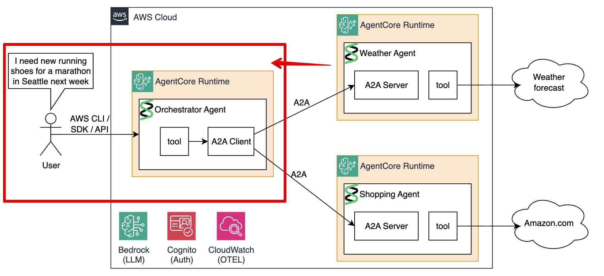

# Module 5: Orchestrator Agent

In this module you will learn about, build, deploy, and test the Orchestrator Agent. 



## Understanding the Code

Open [`agents/orchestrator/main.py`](agents/orchestrator/main.py). The Orchestrator coordinates the Weather and Shopping agents using three layers.

### Layer 1 — Cognito token management

The Orchestrator must authenticate before calling the JWT-protected sub-agents. It fetches a bearer token using the `client_credentials` OAuth2 flow and caches it in memory (refreshing 2 minutes before expiry):

```python
_token_cache: dict = {"token": "", "expires_at": 0.0}

async def get_bearer_token() -> str:
    if time.time() < _token_cache["expires_at"] - 120:
        return _token_cache["token"]   # still valid — return cached

    async with httpx.AsyncClient(timeout=15.0) as client:
        resp = await client.post(COGNITO_TOKEN_ENDPOINT, data={
            "grant_type": "client_credentials",
            "client_id": COGNITO_CLIENT_ID,
            "client_secret": COGNITO_CLIENT_SECRET,
            "scope": "resource/read",
        })
    data = resp.json()
    _token_cache["token"] = data["access_token"]
    _token_cache["expires_at"] = time.time() + data.get("expires_in", 3600)
    return _token_cache["token"]
```

The Cognito credentials arrive via environment variables set in the Terraform `environment_variables` block.

### Layer 2 — A2A client with lazy agent discovery

Before sending a message, the Orchestrator needs each sub-agent's `AgentCard`. `A2ACardResolver` fetches these from `/.well-known/agent-card.json`. Cards are cached in module-level globals and fetched lazily on the first tool call:

```python
_weather_agent_card = None
_shopping_agent_card = None

async def discover_agents():
    httpx_client = await get_httpx_client()   # httpx client with Authorization header set

    _weather_agent_card = await A2ACardResolver(
        httpx_client=httpx_client, base_url=WEATHER_AGENT_URL
    ).get_agent_card()

    _shopping_agent_card = await A2ACardResolver(
        httpx_client=httpx_client, base_url=SHOPPING_AGENT_URL
    ).get_agent_card()
```

`send_message_to_agent()` builds an A2A `Message`, sends it, and extracts the response text. Note that `send_message` yields `(Task, None)` tuples, and `Part` is a Pydantic `RootModel` so text lives at `.root.text`:

```python
async def send_message_to_agent(agent_card, message_text):
    a2a_client = ClientFactory(ClientConfig(httpx_client=httpx_client, streaming=False)).create(agent_card)

    message = Message(
        kind="message", role=Role.user,
        parts=[Part(TextPart(kind="text", text=message_text))],
        message_id=uuid4().hex,
    )

    async for event in a2a_client.send_message(message):
        task, _ = event                               # yields (Task, None) tuples
        text = task.artifacts[0].parts[0].root.text   # Part is a RootModel
        return text
```

### Layer 3 — Strands tools and the agent

The two `@tool` functions contain the lazy-discovery logic and delegate to `send_message_to_agent`:

```python
@tool
async def send_message_to_weather_agent(location: str, timeframe: str):
    """Retrieves weather for {location} and {timeframe}"""
    if _weather_agent_card == None:
        await discover_agents()
    return await send_message_to_agent(
        _weather_agent_card,
        f"Summarize weather for {location} for {timeframe} in less than 10 words",
    )

@tool
async def send_message_to_shopping_agent(weather_conditions: str, item: str):
    """Recommends products given weather conditions and a specific item request."""
    if _shopping_agent_card == None:
        await discover_agents()
    message = f"Weather conditions: {weather_conditions}\nThe user is looking for: {item}"
    return await send_message_to_agent(_shopping_agent_card, message)
```

The system prompt instructs the LLM to always call both tools in sequence:

```python
system_prompt = """You are a personal weather-to-wardrobe and outdoor gear assistant.

For every request:
1. Extract the location and time frame from the user's prompt
2. Call send_message_to_weather_agent with that location and time frame
3. Call send_message_to_shopping_agent with:
   - weather_conditions: the result from step 2
   - item: the specific item or activity from the user's prompt
4. Present a concise combined response: weather summary followed by product recommendations
"""

agent = Agent(
    system_prompt=system_prompt,
    tools=[send_message_to_weather_agent, send_message_to_shopping_agent],
    name="Orchestrator Agent",
)
```

**The entrypoint** uses `BedrockAgentCoreApp` (HTTP mode, not A2A). It's an async generator that yields streaming events back to the caller:

```python
app = BedrockAgentCoreApp()

@app.entrypoint
async def invoke_agent(payload, context):
    prompt = payload.get("prompt", "")

    async with asyncio.timeout(120):
        async for event in agent.stream_async(prompt=prompt):
            if "message" in event or ("event" in event and "metadata" in event["event"]):
                yield event
```

## Build and Push to ECR

```bash
make build-and-push-orchestrator-agent
```

## Deploy to AgentCore

Uncomment the `orchestrator_agent` module in `terraform/workshop.tf`:

```hcl
module "orchestrator_agent" {
  source                 = "./orchestrator-agent"
  project_name           = local.project_name
  region                 = data.aws_region.current.region
  ecr_repo_prefix        = local.project_name_short
  cognito_client_id      = module.cognito.client_id
  cognito_client_secret  = module.cognito.client_secret
  cognito_discovery_url  = module.cognito.discovery_url
  cognito_token_endpoint = module.cognito.token_endpoint
  weather_agent_runtime_url  = module.weather_agent.runtime_url
  shopping_agent_runtime_url = module.shopping_agent.runtime_url
}
```

Then apply:

```bash
make deploy-infra
```

Not that sub-agent URLs and Cognito credentials are injected as environment variables:

```hcl
resource "aws_bedrockagentcore_agent_runtime" "orchestrator_agent" {
  environment_variables = {
    WEATHER_AGENT_RUNTIME_URL  = var.weather_agent_runtime_url
    SHOPPING_AGENT_RUNTIME_URL = var.shopping_agent_runtime_url
    COGNITO_TOKEN_ENDPOINT     = var.cognito_token_endpoint
    COGNITO_CLIENT_ID          = var.cognito_client_id
    COGNITO_CLIENT_SECRET      = var.cognito_client_secret
  }
  network_configuration {
    network_mode = "PUBLIC"
  }
}
```

The runtime ARN is saved to `./tmp/orchestrator_agent_runtime_arn.txt`.

## Test

```bash
make test-orchestrator
```

This runs `orchestrator_invoker.py`, which invokes the agent via boto3:

```python
response = client.invoke_agent_runtime(
    agentRuntimeArn=RUNTIME_ARN,
    payload='{"prompt": "Find me running shoes for a marathon in Seattle next week"}',
    contentType="application/json"
)
```

What happens inside the Orchestrator:
1. Payload arrives at `invoke_agent(payload, context)`
2. LLM reads the prompt and calls `send_message_to_weather_agent(location="Seattle", timeframe="next week")`
3. Orchestrator fetches a Cognito token, discovers the Weather Agent card, sends an A2A message
4. LLM receives the weather result, calls `send_message_to_shopping_agent(weather_conditions="...", item="running shoes for a marathon")`
5. Orchestrator sends A2A message to Shopping Agent
6. LLM synthesizes a final response: weather summary + product recommendations

You will see a stream of events, which includes information about tool calls, token consumption, and LLM interactions. At the end, you will receive a result containing requested information, for example (formatted for readability):

```json
{
  "message": {
    "role": "assistant",
    "content": [
      {
        "text": "
        ## **Seattle Marathon Next Week - Weather & Shoe Recommendations**
        
        **Weather Forecast:** Mostly cloudy with rain, highs mid-50s to 60s°F
        
        **Running Shoe Recommendations:**
        
        For rainy conditions with cool temperatures, prioritize:
            - **Waterproof/water-resistant uppers** to keep feet dry
            - **High-traction outsoles** for grip on wet surfaces
            - **Lightweight cushioning** for marathon distance without excess weight
            
        Top picks include:
            - **adidas Terrex Trailrider** – excellent wet-weather grip [link]
            - **Arc'teryx Norvan LD 4 GTX** – GORE-TEX waterproofing with Vibram grip [link]
            - **Columbia Konos Featherweight** – lightweight with superior traction [link]
            - **ANTA Wilderness 2.0** – great for muddy/wet conditions [link]
            
        The cooler temps (50-60°F) mean you won't overheat, so focus on waterproofing and 
        traction over breathability. Good luck with your marathon!"
      }
    ]
  }
}
```

CONGRATULATIONS! You just deployed a multi-agent solution using A2A on Amazon Bedrock AgentCore!

## Next Step

[Continue to Module 6 - Cleanup](06-cleanup.md)

## Workshop Table Of Contents

1. [Overview](README.md) - Overview, architecture, understanding the protocols.
1. [Prerequisites & Setup](02-prereqs.md) — Install dependencies, QEMU, bootstrap infrastructure, deploy Cognito
2. [Weather Agent](03-weather-agent.md) — Build, deploy, and test the Weather sub-agent
3. [Shopping Agent](04-shopping-agent.md) — Build, deploy, and test the Shopping sub-agent
4. [Orchestrator Agent](05-orchestrator-agent.md) — Build, deploy, and test the Orchestrator + observability & troubleshooting
5. [Cleanup](06-cleanup.md) — Destroy all AWS resources