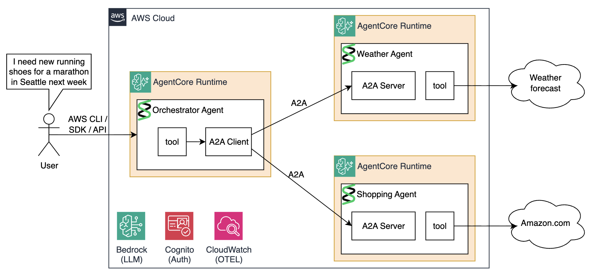

# A2A Multi-Agent Workshop with Strands on AWS Bedrock AgentCore

This workshop demonstrates how to build, deploy, and connect multiple AI agents using the **Agent-to-Agent (A2A) protocol** on **AWS Bedrock AgentCore**. Three agents collaborate: a Weather Agent and a Shopping Agent act as specialized sub-agents, while an Orchestrator Agent coordinates them to answer questions like *"Find me running shoes for a marathon in Seattle next week."*

## Architecture



**Key technologies:**

| Component | Technology |
|---|---|
| Agent framework | [Strands Agents](https://strandsagents.com) |
| Inter-agent protocol | [A2A (Agent-to-Agent)](https://google.github.io/A2A/) — JSON-RPC 2.0 |
| Hosting platform | [AWS Bedrock AgentCore Runtime](https://docs.aws.amazon.com/bedrock-agentcore/latest/devguide/what-is-bedrock-agentcore.html) |
| Authentication | [Amazon Cognito](https://aws.amazon.com/cognito/) (OAuth2 client credentials) |
| Infrastructure | [Terraform](http://developer.hashicorp.com/terraform) |
| Container registry | [Amazon ECR](https://aws.amazon.com/ecr/) |
| Package manager | [uv](https://docs.astral.sh/uv/) |
| Observability | [Amazon CloudWatch](https://aws.amazon.com/cloudwatch/), [OpenTelemetry](https://opentelemetry.io/) |

## How the A2A Protocol Works

**A2A** (Agent-to-Agent) is Google's open standard for inter-agent communication over HTTP. Every A2A-compliant agent exposes two endpoints:

1. **Agent Card** at `GET /.well-known/agent-card.json` — a JSON document describing the agent's name, description, capabilities, and endpoint URL. Clients use this for discovery. You will see it many times during the workshop.
2. **Message endpoint** at `POST /` — accepts JSON-RPC 2.0 messages with method `message/send`.

A message looks like:
```json
{
  "jsonrpc": "2.0",
  "id": "1",
  "method": "message/send",
  "params": {
    "message": {
      "role": "user",
      "messageId": "msg-001",
      "parts": [
        { 
          "kind": "text", 
          "text": "What is the weather in Seattle?" 
        }
      ]
    }
  }
}
```

The response includes artifacts (the agent's answer) in the task result.

## How AgentCore Hosting Works

AgentCore supports several protocols for containerized agents:

**A2A mode** (`server_protocol = "A2A"`):
- AgentCore handles JWT authorization and routes A2A JSON-RPC to the container
- Container uses Strands `A2AServer` + FastAPI, exposing both `/.well-known/agent-card.json` and `POST /`
- Used by: Weather Agent, Shopping Agent

**HTTP mode**:
- AgentCore exposes the container as a plain invocation target, called via `invoke-agent-runtime` using AWS SDK/CLI/API.
- Container uses `BedrockAgentCoreApp` with `@app.entrypoint`
- Used by: Orchestrator Agent

## Project Structure

```
.
├── Makefile                        # Build, deploy, and test commands
├── orchestrator_invoker.py         # Python script for invoking the orchestrator
├── agents/
│   ├── weather/
│   │   ├── main.py                 # Weather agent code
│   │   ├── Dockerfile
│   │   └── pyproject.toml
│   ├── shopping/
│   │   ├── main.py                 # Shopping agent code
│   │   ├── Dockerfile
│   │   └── pyproject.toml
│   └── orchestrator/
│       ├── main.py                 # Orchestrator agent code
│       ├── Dockerfile
│       └── pyproject.toml
└── terraform/
    ├── bootstrap.tf                # Creates initial resources (ECR repos)
    ├── workshop.tf                 # Root module — uncomment agents here as you progress
    ├── providers.tf
    ├── cognito/                    # OAuth2 server and client definition
    ├── weather-agent/              # AgentCore runtime for weather (A2A)
    ├── shopping-agent/             # AgentCore runtime for shopping (A2A)
    └── orchestrator-agent/         # AgentCore runtime for orchestrator (HTTP)
```

## Workshop Steps

1. [Overview](README.md) - Overview, architecture, understanding the protocols.
1. [Prerequisites & Setup](02-prereqs.md) — Install dependencies, QEMU, bootstrap infrastructure, deploy Cognito
2. [Weather Agent](03-weather-agent.md) — Build, deploy, and test the Weather sub-agent
3. [Shopping Agent](04-shopping-agent.md) — Build, deploy, and test the Shopping sub-agent
4. [Orchestrator Agent](05-orchestrator-agent.md) — Build, deploy, and test the Orchestrator + observability & troubleshooting
5. [Cleanup](06-cleanup.md) — Destroy all AWS resources
