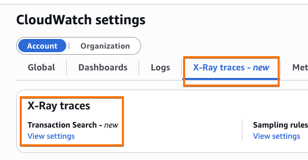
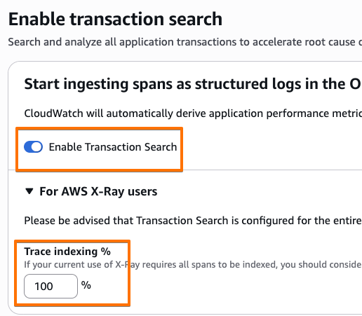
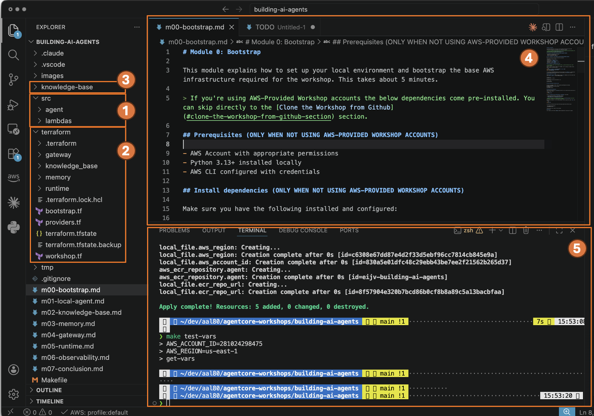

# Module 0: Bootstrap

This module explains how to set up your workshop environment and install required dependencies. This takes about 5 minutes.

## Enable Transaction Search 

This must be done in the AWS Console before deploying:

1. Open AWS Console. When using AWS-provided workshop accounts, click the following link:

    

1. Go to **CloudWatch** -> **Settings (at the very bottom of left side menu)** -> **X-Ray traces tab**

    

1. Click "View settings" for Transactional Search. If **Ingest OpenTelemetry spans** shows disabled, click the **Edit** button and enable it. Set **Trace indexing** to 100% to capture all traces. 

    

1. Enabling **Transactional Search** takes approximately 10 minutes. You do not need to wait - proceed with the next workshop steps. 

## Installing prerequisites (ONLY WHEN NOT USING AWS-PROVIDED WORKSHOP ACCOUNTS)

> If you're using AWS-provided Workshop accounts all below dependencies come pre-installed. You can skip directly to the [Clone the Workshop from Github](#clone-the-workshop-from-github-section) section.

Make sure you have the following installed and configured:

| Requirement | Version | Check |
|---|---|---|
| Python | 3.13 | `python3 --version` |
| uv | latest | `uv --version` |
| AWS CLI | v2 | `aws --version` |
| Terraform | 1.5+ | `terraform --version` |
| make | any | `make --version` |

## Clone the Workshop from Github section

```
git clone --no-checkout --depth 1 https://github.com/aal80/agentcore-workshops
cd agentcore-workshops
git sparse-checkout set building-ai-agents
git checkout
cd building-ai-agents
```

## Explore the project structure in Visual Studio Code



Below are the assets you can find in Visual Studio Code that you'll be using throughout the workshop:

1. Source code of the agent and MCP tools implemented as Lambda functions.
1. Terraform configuration for deploying AgentCore resources. You'll be updating the `workshop.tf` as you progress to introduce new resource types. 
1. Text files representing the technical support Knowledge Base.
1. Main editing window. This is where you'll be making changes to project files. 
1. Terminal window. This is where you'll be running commands. 

## Explore the infrastructure configuration

The Terraform configuration in [./terraform](terraform/) sets up shared resources used across all modules. Explore [terraform/workshop.tf](terraform/workshop.tf). During the workshop you will gradually enable modules in this file.

## Next Step

You're ready to start! Head to [Module 1](m01-local-agent.md) to build your first agent.
