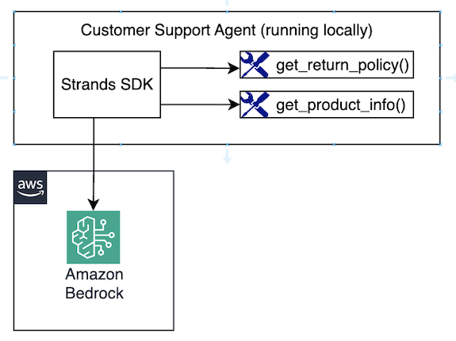

# Module 1: Creating a simple Customer Support agent Prototype

In this first module, you'll build a locally running prototype of a Customer Support Agent. Throughout this workshop, you'll evolve this prototype into a production-ready system running on Bedrock AgentCore, serving multiple customers with persistent memory, knowledge base, shared tools, and full OTEL-based observability.

But to start with, your agent will run locally, use Bedrock-provided model for reasoning, and have the following tools available:

- `get_return_policy()` - Get return policy for specific products
- `get_product_info()` - Get product information



## Creating agent tools with Strands Agents SDK

Let's start with creating two **local** tools - the tools that run within the same process as the agent itself. 

Defining local tools in Strands SDK is simple — add a `@tool` decorator to a Python method and provide a description in the docstring. Strands SDK uses the function documentation, types, and arguments to provide context on the tool to your agent. Let's see this in action. 

### Tool 1: Get Return Policy

**Tool Purpose:** Helps customers understand return policies for different product categories. Provides information about return windows, conditions, processes, and refund timelines. 

```python
from strands.tools import tool

@tool # <-- Turns a Python function into agentic tool
def get_return_policy(product_category: str) -> str:
    """
    Get return policy information for a specific product category.

    Args:
        product_category: Electronics category (e.g., 'smartphones', 'laptops', 'accessories')

    Returns:
        Formatted return policy details including timeframes and conditions
    """

    return_policies = {
        "smartphones": {
            "window": "30 days",
            "condition": "Original packaging, no physical damage, factory reset required",
            "process": "Online RMA portal or technical support",
            "refund_time": "5-7 business days after inspection",
            "shipping": "Free return shipping, prepaid label provided",
            "warranty": "1-year manufacturer warranty included",
        },
        ...REDACTED...
    }
```

Explore the full file at `src/agent/tools/return_policy.py`. 

### Tool 2: Get Product Information

**Tool purpose:** Provides customers with product specs, warranties, features, and compatibility information to help them make informed decisions.

```python
from strands.tools import tool

@tool # <-- Turns a Python function into agentic tool
def get_product_info(product_type: str) -> str:
    """
    Get detailed technical specifications and information for electronics products.

    Args:
        product_type: Electronics product type (e.g., 'laptops', 'smartphones', 'headphones', 'monitors')
    Returns:
        Formatted product information including warranty, features, and policies
    """
    products = {
        "laptops": {
            "warranty": "1-year manufacturer warranty + optional extended coverage",
            "specs": "Intel/AMD processors, 8-32GB RAM, SSD storage, various display sizes",
            "features": "Backlit keyboards, USB-C/Thunderbolt, Wi-Fi 6, Bluetooth 5.0",
            "compatibility": "Windows 11, macOS, Linux support varies by model",
            "support": "Technical support and driver updates included",
        },
        ...REDACTED...
    }
```
Explore the full file: `src/agent/tools/product_info.py`

## Create and Configure the Customer Support Agent

Now that you understand how to create local tools, let's see how to create the agent, attach to these tools, and run it locally.

Explore `src/agent/agent.py`. You can see that it uses Anthropic Claude Haiku 4.5 model via Bedrock, initialized with a system prompt, and the above two tools attached:

```python
# See system_prompt.py for System Prompt
from system_prompt import SYSTEM_PROMPT

# Picking the model
model = BedrockModel(
    model_id="us.anthropic.claude-haiku-4-5-20251001-v1:0",
    temperature=0.3
)

# The list of tools
tools = [
    get_product_info,
    get_return_policy,
    get_technical_support, # Not implemented yet
    mcp_tools_list         # Not implemented yet
]

# Defining the agent
agent = Agent(
    model=model,
    system_prompt=SYSTEM_PROMPT,
    tools=tools,
    session_manager=session_manager, # Not implemented yet
)
```

## Running locally vs in cloud

The same `agent.py` file runs both locally and on AgentCore Runtime (you'll deploy to the cloud in Module 5). The bottom of the file detects the environment using the `AGENTCORE_RUNTIME_URL` environment variable, which AgentCore sets automatically when running in the cloud:

```python
if __name__ == "__main__":
    if os.environ.get("AGENTCORE_RUNTIME_URL"):
        print("Running on AgentCore, starting server...")
        app.run()          # starts the AgentCore HTTP server
    else:
        print("Running locally...")
        run_locally()      # starts an interactive REPL loop
```

When running locally, `run_locally()` starts an interactive prompt loop so you can type questions and see responses without editing any code.

## Testing the agent locally

Start the agent:

```bash
make run-agent-locally
```

> Ignore warnings about MEMORY_ID and mcp_client. You'll add these components in upcoming modules.

You'll see an interactive prompt:

```
--------------------
Welcome to the AwesomeCorp Customer Support Agent

--------------------
User prompt (type 'exit' to quit):
```

### Test general capabilities

Type: `How can you help me?`

The agent describes its capabilities as defined in the system prompt:

```
Hello! I can assist you with a variety of things related to electronics products, including:

- **Product information and specifications** - I can provide detailed info about our electronics products
- **Technical support and troubleshooting** - I can help diagnose and solve technical issues with your devices
- **Return policies and warranties** - I can explain our return and warranty processes
- **Setup guides and maintenance tips** - I can offer step-by-step instructions for using your devices

...REDACTED...
```

> Keep in mind, LLMs are non-deterministic. The response you receive is expected to differ from examples shown in this workshop.

### Test the `get_product_info` tool

Type: `Tell me what you know about headphones?`

The agent automatically invokes `get_product_info` based on the prompt:

```text
I'd be happy to help you learn about headphones! Let me pull up our detailed product information for you.

Tool #1: get_product_info
### Headphones Information

Here's what I know about our headphones:

**Warranty:**  
• 1-year manufacturer warranty

**Specifications:**  
• Available in wired and wireless options  
• Frequency range: 20Hz-20kHz  
• Noise cancellation technology
...REDACTED...
```

### Test the `get_return_policy` tool

Type: `My headphones are broken, what's the return policy?`

The agent automatically invokes `get_return_policy` based on the prompt:

```text
I'll get the return policy information for headphones for you.

Tool #1: get_return_policy
According to our return policy for headphones:

**Headphones Return Policy:**
- **Return window:** 30 days from delivery
- **Condition:** Must be in original condition with all included components
- **Process:** Contact technical support to initiate the return process
- **Refund timeline:** 5-7 business days after inspection
- **Shipping:** Return shipping policies vary depending on your location
- **Warranty:** Standard manufacturer warranty still applies during this period
...REDACTED...
```

Type `exit` to quit. The agentic loop is working — the agent is picking the right tools automatically!

## Congratulations!

You've just learned to create a real AI Agent using Strands Agents SDK and Amazon Bedrock!

- Built an agent with 2 custom local tools (`get_return_policy`, `get_product_info`)
- Tested the agentic loop — the agent selects tools automatically based on context
- Established the foundation for the upcoming modules

Current limitations you'll address in next steps:

- No knowledge base integration — knowledge is hardcoded into the tools
- No memory — the agent doesn't remember past conversations
- Tools are embedded in the app — not reusable across agents
- Running locally only — not scalable
- No authentication, authorization, or access controls
- Minimal observability — debugging is done locally
- No access to enterprise APIs or customer data

## Next step

Proceed to [Module 2](m02-knowledge-base.md) to integrate your agent with a Knowledge Base.
