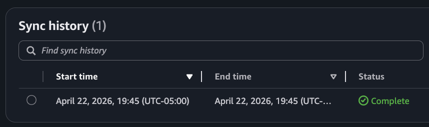

# Module 2: Adding a Knowledge Base

In Module 1 you built an agent with tools that return hardcoded mock data. In this module you'll replace that with a real **Bedrock Knowledge Base** backed by S3 vector storage, so the `get_technical_support` tool can answer questions from actual documentation.

By the end of this module your agent will implement a RAG workflow by querying a Bedrock Knowledge Base for technical support questions.

## How Knowledge Bases and RAG work

When a user asks a technical question, the agent needs to find the right answer from a large set of documents. Rather than injecting all this knowledge into every prompt (expensive and limited by context size), you're going to use a technique called **Retrieval-Augmented Generation (RAG)**:

1. **Ingestion** — you upload source documents (text files in this module) to an S3 bucket. Then you configure a Data Source to point at that bucket. The last step is to trigger an ingestion job. In this module this will be fully automated with Terraform. 
1. **At index time** — when ingestion job is triggered, Knowledge Base Data Source will read the documents, split them into chunks and converted each chunk into a vector embedding (a list of numbers that captures the semantic meaning of the text) using Amazon Titan Embed v2. These embeddings are then stored in the S3 vector index. This is fully automatic. 
1. **At query time** — the user's question is embedded the same way, then a similarity search finds the chunks whose embeddings are closest to the question embedding. Closeness in vector space means similarity in meaning. Corresponding chunks are returned back to your agent. 
1. **Generation** — The agent passes retrieved chunks to the LLM as context, and the LLM composes an answer grounded in knowledge.

## Architecture

The knowledge base infrastructure consists of:

| Resource | Purpose |
|---|---|
| S3 bucket (`*-kb-source`) | Stores the source documentation files |
| S3 vector bucket + index | Stores the vector embeddings (S3 Vectors) |
| Bedrock Knowledge Base | Orchestrates retrieval using Titan Embed v2 |
| Bedrock Data Source | Links the S3 bucket to the KB with fixed-size chunking |
| `null_resource` | Triggers ingestion sync after every deploy |

## Step 1: Deploy the Knowledge Base infrastructure

Open [terraform/workshop.tf](terraform/workshop.tf) and uncomment the `knowledge_base` module:

```hcl
module "knowledge_base" {
  source       = "./knowledge_base"
  project_name = local.project_name
  region       = data.aws_region.current.region
}
```

Then deploy:

```bash
make deploy-infra
```

This will:
1. Create an S3 source bucket and upload the 6 documentation files from [knowledge-base/](knowledge-base/). Explore these files in VS Code to see what information is going into the Knowledge Base.
2. Create an S3 vector bucket and index (1024 dimensions, cosine similarity, float32)
3. Create the Bedrock Knowledge Base and configure it to use Amazon Titan Embed v2
4. Start an ingestion job to embed and index all documents
5. Write the Knowledge Base ID to `tmp/tech_support_kb_id.txt` (so you can do local testing)

Typically ingestion takes 1-2 minutes. Monitor progress in the AWS Console:

1. Open the [Amazon Bedrock console](https://console.aws.amazon.com/bedrock/)
2. In the left navigation panel, go to **Build -> Knowledge bases**
3. Click on your knowledge base (named `<prefix>-building-ai-agents-tech-support`)
4. Under the **Data source** section, click the datasource named `<prefix>-building-ai-agents-from-s3`
5. See the **Sync history** section. You should see an entry with a `Complete` status. 



## Step 2: Verify the Knowledge Base is working

Once ingestion is complete, test it directly from the AWS Console:

1. In your knowledge base page, click **Test knowledge base** (top right)
2. Select `Retrieval only: data sources`, this restricts Knowledge Base to return information as received from the vector database, without any additional LLM processing. 
2. In the test panel, type: `how do I fix Wi-Fi connection problems`
3. Click **Run**

You should see scored text chunks returned from the documentation. Click `Details` to see result scores. If the results are empty, ingestion may still be in progress — refresh the data source status and try again in a moment.

## Step 3: Enable the `get_technical_support` tool

Examine the [src/agent/tools/tech_support.py](src/agent/tools/tech_support.py). The tool reads the KB ID from the `TECH_SUPPORT_KB_ID` environment variable at import time:

```python
#Retrieve Knowledge Base ID from environment variable
TECH_SUPPORT_KB_ID = os.environ.get("TECH_SUPPORT_KB_ID")
if not TECH_SUPPORT_KB_ID:
    raise ValueError("TECH_SUPPORT_KB_ID environment variable is not set.")

@tool
def get_technical_support(issue_description: str) -> str:
    region = boto3.Session().region_name
    tool_use = {
        "toolUseId": "tech_support_query",
        "input": {
            "text": issue_description,
            "knowledgeBaseId": TECH_SUPPORT_KB_ID,
            "region": region,
            "numberOfResults": 3,
            "score": 0.4,
        },
    }
    result = retrieve.retrieve(tool_use)
    return result["content"][0]["text"]
```

Now open [src/agent/main.py](src/agent/main.py) and uncomment the `get_technical_support` tool usage:

```python
agent = Agent(
    model=model,
    system_prompt=SYSTEM_PROMPT,
    tools=[
        get_product_info,
        get_return_policy,

        # Uncomment below line
        get_technical_support,
    ],
)
```

Make sure that the test prompt at the bottom is requiesting technical support:

```python
if __name__ == "__main__":
    # agent("How can you help me?")
    # agent("My headphones are broken, what's the return policy?")
    agent("My headphones are broken, I need technical support")
```

## Step 4: Run the agent

`make test-agent-locally` automatically reads `tmp/tech_support_kb_id.txt` and passes it as the `TECH_SUPPORT_KB_ID` environment variable:

```bash
make test-agent-locally
```

This time the agent will invoke `get_technical_support` and return content retrieved from the Knowledge Base:

```
Tool #1: get_technical_support
I can help you troubleshoot your broken headphones. Based on the technical support information, here are some common solutions for headphone issues:

### Basic Troubleshooting Steps:

1. **Check Power and Connections:**
   - Make sure your headphones are properly charged or connected to power
   - Verify all cables are securely connected
   - Try a different cable if available

... REDACTED ...   
```

The agent is now answering from real documentation rather than hardcoded strings.

## How it works under the hood

1. The agent receives the user's prompt, passes it to LLM along with the list of all available tools. 
1. LLM decides that `get_technical_support` is the right tool to use 
1. The agent calls `get_technical_support` tool
1. The tool calls `strands_tools.retrieve`, a built-in Strands tool that wraps the Bedrock Knowledge Base API, passing the issue description as the query text
1. Knowledge Base embeds the query using Titan Embed v2 and performs a vector similarity search against the S3 index
1. The top 3 matching chunks (above score threshold 0.4) are returned
1. The agent uses those chunks to compose a response

## Congratulations!

You've just integrated a real Bedrock Knowledge Base into your agent!

In the next module you'll learn how to add memory to your agent so it can remember past sessions and interactions.


