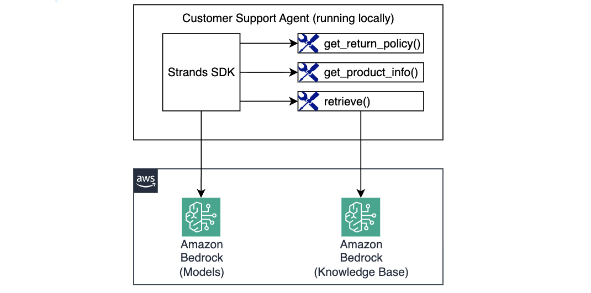
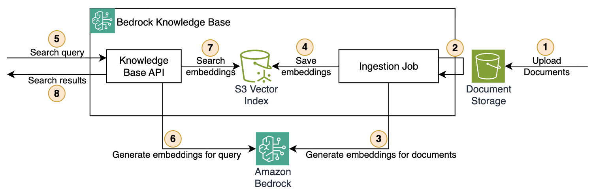
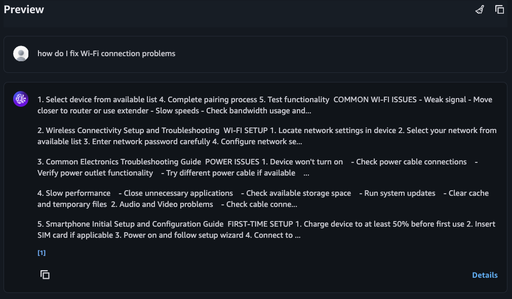

# Module 2: Adding a Knowledge Base

In the previous module you built an agent with tools that return hardcoded mock data. In this module you'll replace that with a real **Bedrock Knowledge Base** backed by S3 vector storage, so the `get_technical_support` tool can answer questions from actual documentation.

By the end of this module your agent will implement a RAG workflow by querying a Bedrock Knowledge Base for technical support questions.



## Knowledge Bases and RAG architecture

When a user asks a technical question, the agent needs to find the right answer from a large set of documents. Rather than injecting all this knowledge into every prompt (expensive and limited by context size), you're going to use a technique called **Retrieval-Augmented Generation (RAG)**:



* **Ingestion** — you upload source documents (text files in this module) to an S3 bucket. Then you configure a Data Source to point at that bucket. The last step is to trigger an ingestion job. In this module this will be fully automated with Terraform. 
* **At index time** — when ingestion job is triggered, Knowledge Base Data Source will read the documents, split them into chunks and converted each chunk into a vector embedding (a list of numbers that captures the semantic meaning of the text) using Amazon Titan Embed v2. These embeddings are then stored in the S3 vector index. This is fully automatic. 
* **At query time** — the user's question is embedded the same way, then a similarity search finds the chunks whose embeddings are closest to the question embedding. Closeness in vector space means similarity in meaning. Corresponding chunks are returned back to your agent. 
* **Generation** — The agent passes retrieved chunks to the LLM as context, and the LLM composes an answer grounded in knowledge.

## Before you start implementing

Edit `agent.py`, comment out all the prompts from the first module, and uncomment the prompt for Module 2: 

```python
if __name__ == "__main__":
    # Prompts for Module 2 - uncomment when instructed
    prompt = "My wireless headphones are not turning on, I need technical support"
```

Run `make test-agent-locally` again. 

The agent responds with some information but cannot provide real technical support since `get_technical_support` tool is not implemented yet. 

```
I appreciate you reaching out! I'd like to help you troubleshoot your wireless headphones. 
However, I notice that I don't have access to a technical support tool at the moment that 
would provide me with our comprehensive troubleshooting guides and step-by-step solutions.
```

Let's fix that!

## Step 1: Deploy the Knowledge Base infrastructure

Open [terraform/workshop.tf](terraform/workshop.tf) and uncomment the `knowledge_base` module:

```hcl
module "knowledge_base" {
  source       = "./knowledge_base"
  project_name = local.project_name
  region       = data.aws_region.current.region
}
```

Then deploy:

```bash
make deploy-infra
```

This will perform the following actions:
1. Create an S3 bucket to store original knowledge documents and upload the 6 documentation files from [knowledge-base/](knowledge-base/). Explore these files in VS Code to see what information is going into the Knowledge Base.
1. Create an S3 vector bucket and index (1024 dimensions, cosine similarity, float32)
1. Create the Bedrock Knowledge Base and configure it to use Amazon Titan Embed v2 model.
1. Start an ingestion job to embed and index all documents
1. Write the Knowledge Base ID to `tmp/tech_support_kb_id.txt` (so you can do local testing).

Typically, ingestion takes 1-2 minutes. You can explore Terraform configuration under `./terraform/module/knowledge_base` in the meanwhile. 

Once deployment completes, monitor the ingestion progress using AWS Console:

1. Open the [Amazon Bedrock console](https://console.aws.amazon.com/bedrock/)
1. In the left navigation panel, go to **Build -> Knowledge bases**
1. Click on your knowledge base (named `<prefix>-building-ai-agents-tech-support`)
1. Under the **Data source** section, click the datasource named `<prefix>-building-ai-agents-from-s3`
1. See the **Sync history** section. You should see an entry with a `Complete` status. 


## Step 2: Verify the Knowledge Base is working

Once ingestion is complete, test it directly from the AWS Console:

1. Return to the Tech Support knowledge base page, click the **Test knowledge base** button on top right. 
1. Select `Retrieval only: data sources`, this restricts Knowledge Base to return information as received from the vector database, without any additional LLM processing. 
1. In the test panel, type `How do I fix Wi-Fi connection problems` and hit **Enter**.

You should see scored text chunks returned from the documentation. 



You can click `Details` to see result scores. 

> If the results are empty, ingestion may still be in progress — refresh the data source status and try again in a moment.

## Step 3: Using the `get_technical_support` tool

Examine the [src/agent/tools/tech_support.py](src/agent/tools/tech_support.py) file. The tool reads the KB ID from the `TECH_SUPPORT_KB_ID` environment variable at loading. Then it uses the `retrieve` tool available from Strands SDK to retrieve information from the Knowledge Base. 

```python
TECH_SUPPORT_KB_ID = os.environ.get("TECH_SUPPORT_KB_ID")
l.info(f"ℹ️ TECH_SUPPORT_KB_ID={TECH_SUPPORT_KB_ID}")

@tool
def get_technical_support(issue_description: str) -> str:
    region = boto3.Session().region_name
    tool_use = {
        "toolUseId": "tech_support_query",
        "input": {
            "text": issue_description,
            "knowledgeBaseId": TECH_SUPPORT_KB_ID,
            "region": region,
            "numberOfResults": 3,
            "score": 0.4,
        },
    }
    result = retrieve.retrieve(tool_use)
    return result["content"][0]["text"]
```

See [src/agent/agent.py](src/agent/agent.py), around line 20. The tools list already contains `get_technical_support` and now it is actually connected to the real Knowledge Base. 

```python
# agent.py
tools = [
    get_return_policy, 
    get_product_info, 
    get_technical_support,
]
```

## Step 4: Run the agent

Make sure that the test prompt at the bottom is requiesting technical support:

```python
if __name__ == "__main__":
    # Prompts for Module 2 - uncomment when instructed
    prompt = "My wireless headphones are not turning on, I need technical support"
```

Run `make test-agent-locally` again. 

This time the agent will invoke `get_technical_support` and return content retrieved from the Knowledge Base:

```
I'll help you troubleshoot your wireless headphones. Let me get our technical support documentation for this issue.

Tool #1: get_technical_support
Great! I found some troubleshooting guidance. Here are the steps to help get your wireless headphones turning on:

## **Troubleshooting Steps for Wireless Headphones Not Turning On:**

### **1. Check the Battery/Power**
   - **Charge your headphones** - Connect them to a charger and let them charge for at least 15-30 minutes
   - Check if the charging cable is properly connected
   - Try a different USB cable or power adapter if available
   - Look for LED indicators that show charging status
... REDACTED ...   
```

The agent is now grounding it's answers using real documentation rather than hardcoded strings.

## How it works under the hood

1. The agent receives the user's prompt, passes it to LLM along with the list of all available tools. 
1. LLM decides that `get_technical_support` is the right tool to use 
1. The agent calls `get_technical_support` tool
1. The tool calls `strands_tools.retrieve`, a built-in Strands tool that wraps the Bedrock Knowledge Base API, passing the issue description as the query text
1. Knowledge Base embeds the query using Titan Embed v2 and performs a vector similarity search against the S3 index
1. The top 3 matching chunks (above score threshold 0.4) are returned
1. The agent uses those chunks to compose a response

## Congratulations!

You've just integrated a real Bedrock Knowledge Base into your agent!

## Next step

Proceed to [Module 3](m03-memory.md) to integrate your agent with a AgentCore Memory so it can remember past sessions and interactions.


