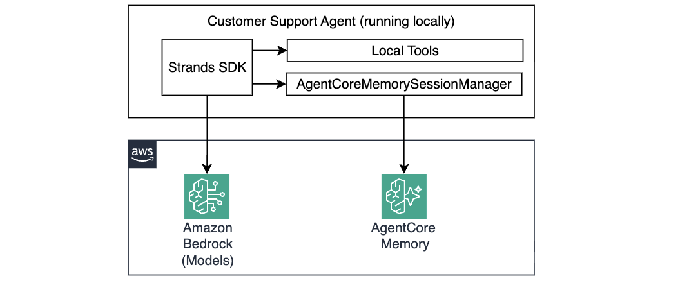
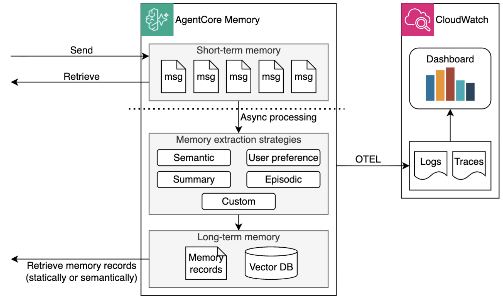

# Module 3: Personalizing the Agent with Memory

In the previous module, your agent gained the ability to answer technical questions using grounded facts stored in the Bedrock Knowledge Base. But it still has no recollection of the past — every conversation starts from scratch. Ask it "What did I ask you about last time?" and it has no idea.



In this module you'll add **Amazon Bedrock AgentCore Memory** so the agent can remember customer preferences, facts, and past interaction episodes across sessions.

## How AgentCore Memory works

AgentCore Memory is a managed service that sits between your agent and the conversation history. 



It organizes memory into two tiers:

- **Short-term memory (STM)** — the current session's conversation, stored after user, agent, and model exchange messages. 
- **Long-term memory (LTM)** — persistent patterns and facts, extracted asynchronously from STM and organized by namespace using vector embeddings for semantic retrieval.

You can configure various **strategies** that define what kind of information to store and where, for example:

| Strategy | What it captures | Example |
|---|---|---|
| `USER_PREFERENCE` | Behavioral patterns, preferences, habits | "prefers ThinkPad, budget under $1200" |
| `SEMANTIC` | Factual information from conversations | "MacBook Pro order #MB-78432 under warranty" |
| `SUMMARY` | Condensed real-time summaries of a single session — key topics, tasks, decisions | "User reported overheating issue, agent recommended cleaning vents and updating drivers" |
| `EPISODIC` | Structured sequences of past interactions across sessions, including situation, intent, and outcome; also generates cross-episode reflections | "Agent resolved a deployment error by switching tools after first attempt failed" |

Each user's memories are isolated using **namespaces** with `{actorId}` as a placeholder — so `support/customer/{actorId}/preferences/` becomes a unique memory space per user at runtime.

When the agent starts a conversation, `AgentCoreMemorySessionManager` class provided by Strands SDK automatically:
1. Retrieves relevant memories and injects them into the context
2. Stores the new conversation memory for async LTM processing

## Step 1: Before enabling memory

Before you add memory capabilities to your agent, let's illustrate the problem. 

Update `agent.py` so only the prompt asking about overheating will be active, as shown below, and test the agent:

```python
if __name__ == "__main__":
    # Prompts for Module 3 - uncomment when instructed
    prompt = "My MacBook Pro overheating during video editing, what's the return policy?"
    # prompt = "What was my previous problem?"
```

```bash
make test-agent-locally
```

Then switch to the follow-up prompt and run the test again:

```python
if __name__ == "__main__":
    # Prompts for Module 3 - uncomment when instructed
    # prompt = "My MacBook Pro overheating during video editing, what's the return policy?"
    prompt = "What was my previous problem?"
```

```bash
make test-agent-locally
```

The agent has no idea what you're referring to:

```
I don't have access to your previous conversation history, so I can't see what your previous problem was. 

To help you effectively, could you please share some details about:
- What product or issue you're currently facing
- Any specific symptoms or errors you're experiencing
- When the problem started
```

It starts each run completely fresh. This is exactly the limitation you're fixing.

## Step 2: Enable AgentCore Memory

Open [terraform/workshop.tf](terraform/workshop.tf) and uncomment the `memory` module:

```hcl
module "memory" {
  source       = "./memory"
  project_name = local.project_name
  region       = data.aws_region.current.region
}
```

Then deploy changes:

```bash
make deploy-infra
```

This creates the AgentCore Memory store with two strategies configured and writes the Memory ID to `tmp/memory_id.txt`.

Deployment can take several minutes. In the meanwhile, explore `./terraform/module/memory` resources. 

Once Terraform completes, verify the memory resources were created using the AWS Console:

1. Open the [Amazon Bedrock AgentCore console](https://console.aws.amazon.com/bedrock-agentcore/)
2. In the left navigation, go to **Build → Memory**
3. You should see `<prefix>-building-ai-agents-customer-support` with status **Active**

## Step 3: Understand AgentCoreMemorySessionManager usage

The memory configuration is implemented in [src/agent/memory_config.py](src/agent/memory_config.py). Explore this file to understand what's being configured:

```python
MEMORY_ID = os.environ.get("MEMORY_ID")
ACTOR_ID = "customer-123"   # In production this comes from the authenticated user identity

memory_config = AgentCoreMemoryConfig(
    memory_id=MEMORY_ID,
    session_id=str(uuid.uuid4()),
    actor_id=ACTOR_ID,
    retrieval_config={
        "support/customer/{actorId}/semantic/":    RetrievalConfig(top_k=3, relevance_score=0.2),
        "support/customer/{actorId}/preferences/": RetrievalConfig(top_k=3, relevance_score=0.2),
    }
)

session_manager = AgentCoreMemorySessionManager(memory_config)
```

Now open [src/agent/agent.py](src/agent/agent.py). The memory integration is already wired in:

```python
agent = Agent(
    model=model,
    system_prompt=SYSTEM_PROMPT,
    tools=tools,
    session_manager=session_manager, # <-- here
)
```

## Step 4: Repeat the test with memory enabled

Repeat the same two runs from previous step.

**First run** — same prompt, now with memory enabled:

```python
if __name__ == "__main__":
    # Other questions
    prompt = "My MacBook Pro overheating during video editing, what's the return policy?"
    # prompt = "What was my previous problem?"
```

```bash
make test-agent-locally
```

The agent answers as before, but this time the conversation is stored in the Short-term Memory. AgentCore asynchronously extracts it into Long-term memory — wait for about a minute before the next run.

**Second run** — switch back to the follow-up:

```python
if __name__ == "__main__":
    # Other questions
    # agent("My new MacBook Pro overheating during video editing, what's the return policy?")
    agent("what was my previous problem?")
```

```bash
make test-agent-locally
```

This time the agent recalls the MacBook Pro overheating issue from the previous session — without you mentioning it. 

```
Your previous problem was **overheating issues with your MacBook Pro specifically during video editing**. 

Since you mentioned this is a new MacBook Pro that you use for video editing work, overheating during intensive tasks like video editing is a common concern, especially when rendering large files or using demanding software.
```

That's memory persistance and retrieval in action!

## How it works under the hood

1. `AgentCoreMemorySessionManager` queries both memory namespaces for context relevant to the incoming message
1. Retrieved memories are injected into the conversation context before the LLM sees the prompt
1. The LLM composes a response informed by the customer's history
1. After the response, the new exchange is stored as an STM event
1. AgentCore asynchronously processes STM events into LTM strategies (preferences + semantic facts)

## Congratulations!

Your agent now remembers customers across sessions!

## Next Step

Proceed to [Module 4](m04-gateway.md) to integrate your agent with AgentCore Gateway to securely share tools across multiple agents.
