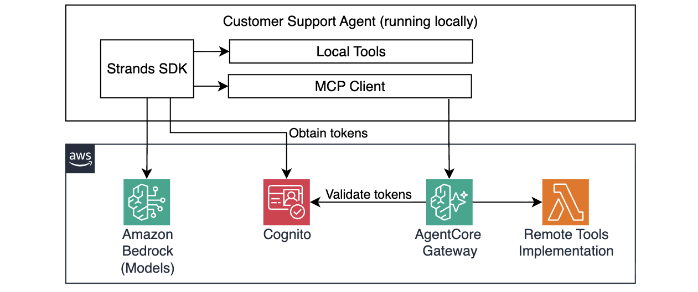
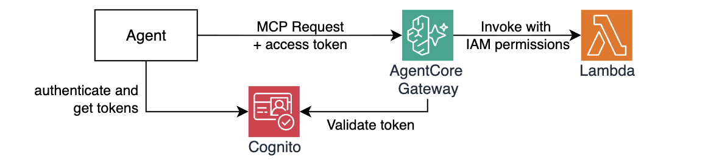

# Module 4: Scaling with AgentCore Gateway & Identity

In Module 3 your agent gained persistent memory. But every tool it uses — `get_return_policy`, `get_product_info`, `get_technical_support` — lives directly in its own codebase.

Imagine you now have to build a Sales Agent that needs `get_product_info`, a Returns Agent that needs `get_return_policy`, and an Inventory Agent that needs both. You'd copy the same tool code into every agent. Any fix or change has to be replicated everywhere. There's no central place to control which agent is allowed to call which tool.

In this module you'll solve that with **Amazon Bedrock AgentCore Gateway**. Gateway converts a wide variety of targets, such as Lambda functions or HTTP endpoints, into [Model Context Protocol (MCP)](https://modelcontextprotocol.io/docs/getting-started/intro) endpoints — a standard that any agent framework understands. Your agents connect to a single Gateway URL and discover all available tools through the MCP protocol, regardless of where the underlying implementations are deployed.




## Why this  matters

| Before (Modules 1–3) | After (this module) |
|---|---|
| Each agent has its own copy of each tool | Tools are deployed once, shared across agents |
| Updating a tool means updating every agent | Update the tool implementation, such as a Lambda function, all agents see the change |
| No access control between agents and tools | Cognito JWT authentication + Cedar policies |
| Tools run on your laptop | Tools run in cloud and are always available |

## Authentication Model

In addition to scaling, AgentCore Gateway adds the security layer. It requires agents to securely authenticate both inbound and outbound connections. **AgentCore Identity** provides seamless agent identity and access management across AWS services and third-party applications such as Slack and Zoom, while supporting any standard OAuth2 identity providers such as Okta, Entra, and Amazon Cognito. In this module you'll see how AgentCore Gateway integrates with AgentCore Identity to provide secure connections via inbound and outbound authentication.



**Inbound authentication** — When an agent (or other MCP client) calls a tool in the Gateway, it passes an OAuth2 access token generated from the user's Identity Provider (IdP). AgentCore Gateway validates this token and uses it to decide whether to allow or deny the request.

**Outbound authentication** — When the Gateway invokes a downstream target (such as a Lambda function), it can use either OAuth2 access token, API Key, or AWS IAM role associated with the Gateway to authorize that call. This means the agent NEVER holds long-lived credentials for downstream resources.

## Step 1: Before using Gateway

Before adding Gateway, let's confirm what the current agent is doing. Make sure the test prompt in [src/agent/local_agent.py](src/agent/local_agent.py) asks a warranty question:

```python
if __name__ == "__main__":
    # ... prompts from previous modules, comment them out
    agent("I have a Gaming Console Pro. My warranty serial number is MNO33333333. Am I covered?")
```

```bash
make test-agent-locally
```

The agent has no `check_warranty_status` tool yet — it will fall back to the knowledge base or admit it can't answer. 

## Step 2: Deploy the Gateway infrastructure

Open [terraform/workshop.tf](terraform/workshop.tf) and uncomment the `gateway` module:

```hcl
module "gateway" {
  source       = "./gateway"
  project_name = local.project_name
  region       = data.aws_region.current.region
}
```

Then deploy:

```bash
make deploy-infra
```

This will:
1. Deploy a Lambda function containing `check_warranty_status`
2. Create a Cognito User Pool and App Client for inbound JWT authentication
3. Create the AgentCore Gateway with the Cognito JWT authorizer
4. Register the Lambda as a Gateway target, exposing the tool as an MCP tool
5. Write `tmp/gateway_url.txt`, `tmp/cognito_token_endpoint.txt`, `tmp/cognito_client_id.txt`, and `tmp/cognito_client_secret_arn.txt`

While deployment is running, explore resources under `./terraform/module/gateway`.

The Gateway resource declares mandatory authorization using Cognito provider OAuth2 token and scope.

```hcl
resource "aws_bedrockagentcore_gateway" "customer_support" {
  name        = "${var.project_name}-customersupport-gw"
  authorizer_type = "CUSTOM_JWT"
  authorizer_configuration {
    custom_jwt_authorizer {
      discovery_url  = local.cognito_discovery_url
      allowed_scopes = [local.cognito_scope]
    }
  }
  ...REDACTED...
}
```

The Gateway target resource defines outbound authorization with IAM Role as well as tool schema:

```hcl
resource "aws_bedrockagentcore_gateway_target" "check_warranty_status" {
  name               = "check-warranty-status"

  credential_provider_configuration {
    gateway_iam_role {}
  }

  target_configuration {
    mcp {
      lambda {
        lambda_arn = aws_lambda_function.tool_check_warranty_status.arn

        tool_schema {
          inline_payload {
            name        = "check_warranty_status"

            input_schema {
              type = "object"

              property {
                name        = "serial_number"
                type        = "string"
                description = "Product serial number to look up"
                required    = true
              }

...REDACTED...

```

Once Terraform completes, verify the Gateway is active in the AWS Console:

1. Open the [Amazon Bedrock AgentCore console](https://console.aws.amazon.com/bedrock-agentcore/)
2. In the left navigation, go to **Build → Gateway**
3. You should see `<prefix>-customersupport-gw` with status **Active**
4. Click into it and confirm the **Targets** tab shows the Lambda target with the `check_warranty_status` tool and `Ready` status.

## Step 3: Understand the centralized tool

Examine the Lambda function code at [src/lambdas/tool-check-warranty-status/handler.py](src/lambdas/tool-check-warranty-status/handler.py). It implements mock warranty database, checking warranty coverage given a product serial number and optionally a customer email: 

```python
def lambda_handler(event, context):
    serial_number  = event.get("serial_number", "")
    customer_email = event.get("customer_email")
    # looks up warranty coverage from customer database
```

The tool schema that describes this to the Gateway is defined inline in [terraform/gateway/gateway.tf](terraform/gateway/gateway.tf) as an `inline_payload` block (illustrated above). It tells Gateway the tool name, description, and input parameters — the same information the `@tool` docstring would provide locally.

## Step 4: Get a Cognito access token

The Gateway requires a valid JWT token for every request. Let's test that one can be fetched using Cognito credentials. 

> This step is for illustration purposes only, the agent will fetch access tokens on its own. 

```bash
make get-cognito-access-token
```

This reads `tmp/cognito_token_endpoint.txt`, `tmp/cognito_client_id.txt`, and retrieves the client secret from AWS Secrets Manager using the ARN in `tmp/cognito_client_secret_arn.txt`, then calls the Cognito token endpoint and outputs the retrieved token.

## Step 5: Connect the agent to Gateway

Unlike local tools you've implemented previously, you do not need to declare tools available through MCP and AgentCore gateway one by one. MCP supports automatic tool discovery, so you only need to point your agent at the Gateway andpoing. 

Explore [src/agent/mcp_client.py](src/agent/mcp_client.py). There are several important segments to understand. 

First, on initialization this module imports required configuration from environment variables:

```python
GATEWAY_URL = os.environ.get("GATEWAY_URL")
COGNITO_CLIENT_ID = os.environ.get("COGNITO_CLIENT_ID")
COGNITO_CLIENT_SECRET_ARN = os.environ.get("COGNITO_CLIENT_SECRET_ARN")
COGNITO_TOKEN_ENDPOINT = os.environ.get("COGNITO_TOKEN_ENDPOINT")
COGNITO_SCOPE = os.environ.get("COGNITO_SCOPE")
```

Second, it retrieves the access token required to invoke the Gateway from Cognito:

```python
    sm = boto3.client("secretsmanager")
    cognito_client_secret = sm.get_secret_value(SecretId=COGNITO_CLIENT_SECRET_ARN)["SecretString"]

    def _get_gateway_token() -> str:
        response = requests.post(
            COGNITO_TOKEN_ENDPOINT,
            data={
                "grant_type":    "client_credentials",
                "client_id":     COGNITO_CLIENT_ID,
                "client_secret": cognito_client_secret,
                "scope":         COGNITO_SCOPE,
            },
        )
        response.raise_for_status()
        return response.json()["access_token"]

    gateway_token = _get_gateway_token()
```

> Note that for brevity this sample code does not implement token renewal. You will need to monitor expiration date and renew tokens in your real agents. 

Lastly, the MCP client retrieves the list of tools using `GATEWAY_URL` and previously obtained access token:

```python
    mcp_client = MCPClient(lambda: streamablehttp_client(
        GATEWAY_URL,
        headers={"Authorization": f"Bearer {gateway_token}"}
    ))

    mcp_client.start()
    mcp_tools_list = mcp_client.list_tools_sync()
```

The agent code automatically picks up the new list of MCP tools (see `agent.py`)

```python
# agent.py
from mcp_client import mcp_tools_list

tools = [
    get_return_policy, 
    get_product_info, 
    get_technical_support,
    mcp_tools_list # <-- here
]

agent = Agent(
    model=model,
    system_prompt=SYSTEM_PROMPT,
    tools=tools,
    session_manager=session_manager,
)

```

The agent sees remote tools exactly like a local `@tool`-decorated function.

## Step 6: Run the agent with Gateway tools

Run `make test-agent-locally` and see the result:

```
I'll check the warranty status for your Gaming Console Pro right away.

Tool #1: check-warranty-status___check_warranty_status

Great news! **Your Gaming Console Pro is covered under warranty!**

Here are the details:
- **Product:** Gaming Console Pro
- **Serial Number:** MNO33333333
- **Warranty Status:** Active
- **Coverage Until:** June 30, 2026

Your warranty is active and valid, so you're well protected! You have coverage for quite some time yet.
```

## How it works under the hood

1. `mcp_client.list_tools_sync()` connects to `GATEWAY_URL` with the access token retrieved from Cognito.
2. Gateway validates the token against the Cognito User Pool's discovery URL
3. Gateway returns the MCP tool manifest (names, descriptions, schemas) from the inline tool schema defined in Terraform
4. When the agent selects `check_warranty_status`, it invokes the tool via the MCP session
5. Gateway forwards the request to the Lambda function
6. Lambda executes and returns the result
7. Gateway returns the result back to the MCP client, which surfaces it to the agent

Authentication is enforced at Step 2 — no valid JWT means no tool access, regardless of which agent is calling.


## Congratulations!

Your tools are now centralized and authenticated.

- **`check_warranty_status`** is a new remote tool that can be used by any authorized agents without any local code
- **Cognito JWT authentication** enforces that only agents with valid tokens can call any tool
- **MCPClient** is the only change to the agent code — it connects to the Gateway and pulls tools over MCP

## Next step

Proceed to [Module 5](m05-runtime.md) to finally deploy your agent to the cloud to run on AgentCore Runtime.
