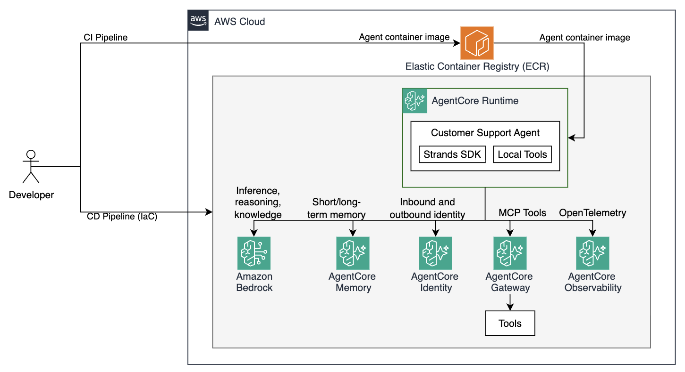
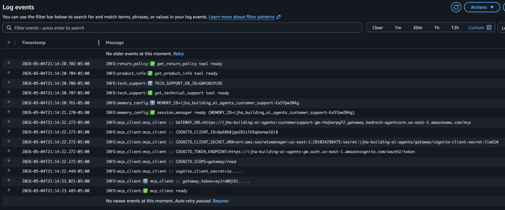

# Module 5: Deploying the Agent to AgentCore Runtime

In the previous module your agent became a secure, gateway-connected service with centralized tools. But it still runs on your laptop. Every time your machine sleeps or restarts, the agent disappears. There's no scalable endpoint, tenant session isolation, and no observability pipeline to tell you what the agent is actually doing in production.

In this module you'll deploy the agent to **Amazon Bedrock AgentCore Runtime** — a fully managed runtime purpose-built for AI agents. AgentCore Runtime handles session management, auto-scaling, and built-in observability so you can focus on agent logic instead of infrastructure.

## Why this matters

| Before (Modules 1–4) | After (this module) |
|---|---|
| Agent runs locally | Agent runs on managed cloud compute |
| No HTTP endpoint to call | Can be invoked by anyone (with the right access permissions) |
| No operational visibility | CloudWatch GenAI Observability: traces, spans, token counts |
| Session state in memory | AgentCore manages session lifecycle, incl. long-term memory |
| Manual scaling | Auto-scaled by the runtime |

## Architecture



## How AgentCore Runtime works

AgentCore Runtime runs your agent in managed microVMs. You provide the agent code either as a .zip file or container image hosted in Amazon Elastic Container Registry (ECR). The runtime handles the rest - routing requests to your container, enforcing authorization, managing session context, auto-scaling, emitting telemetry to CloudWatch, and more. 

## Step 1: Update agent.py to run as a cloud service

Open [src/agent/agent.py](src/agent/agent.py). The `BedrockAgentCoreApp` integration is already wired in. There are four key lines that make the agent work as a managed runtime service:

```python
# 1. Import the runtime application class
from bedrock_agentcore.runtime import BedrockAgentCoreApp

# 2. Create the application instance
app = BedrockAgentCoreApp()

# 3. Declare the entrypoint — called by the runtime on every invocation
@app.entrypoint
async def invoke(payload, context=None):
    ...

# 4. Start the HTTP server (at the bottom of the file)
if __name__ == "__main__":
    app.run()
```

You just need to switch the entrypoint at the bottom of the file. Comment out (or delete) all the prompts you used in previous modules, as well as `asyncio.run()`. Uncomment `app.run()` at the bottom, as shown below:

```python
if __name__ == "__main__":
    # Comment out prompts and the asyncio.run line used in previous modules
    # prompt.....
    # asyncio.run(invoke({"prompt": prompt}))

    # Uncomment to run as AgentCore Runtime service
    app.run()
```

`app.run()` starts the HTTP server that AgentCore Runtime calls when your agent is invoked. The `context` object passed to `invoke` contains `session_id` and `request_headers` — the runtime populates `session_id` automatically, which `memory_config.py` uses for per-session AgentCore Memory isolation.


## Step 2: Build and push the agent image

### Login to ECR

```bash
make login-to-ecr
```

This authenticates Docker against your ECR registry using the account ID and region cached in `./tmp/`.

Build and push in one step:

```bash
make build-and-push-agent
```

This builds the image tagged with the ECR URI and pushes it to ECR.

> **Note:** The first build takes a few minutes. Subsequent builds are faster because most layers are cached.

## Step 3: Deploy agent to AgentCore Runtime

Open [terraform/workshop.tf](terraform/workshop.tf) and uncomment the `runtime` module. See the configuration passed to the runtime module from previously deployed components, such as memory, knowledge base, cognito, and gateway.

```hcl
# --- Module 5: Uncomment to deploy AgentCore Runtime infrastructure
module "runtime" {
  source                        = "./runtime"
  project_name                  = local.project_name
  region                        = data.aws_region.current.region
  ecr_repo_name                 = aws_ecr_repository.agent.name
  ecr_repo_url                  = aws_ecr_repository.agent.repository_url
  agentcore_memory_id           = module.memory.memory_id
  tech_support_knowledgebase_id = module.knowledge_base.kb_id
  gateway_url                   = module.gateway.gateway_url
  cognito_client_id             = module.gateway.cognito_client_id
  cognito_client_secret_arn     = module.gateway.cognito_client_secret_arn
  cognito_token_endpoint        = module.gateway.cognito_token_endpoint
  cognito_scope                 = module.gateway.cognito_scope
}
```

Then apply:

```bash
make deploy-infra
```

Deployment takes a few minutes. While waiting, explore the resources in [terraform/runtime/](terraform/runtime/).

## Step 4: Test the newly deployed the agent

Once deployment completes, test your agent:

```bash
make invoke-agent
```

This base64-encodes a test payload and calls `aws bedrock-agentcore invoke-agent-runtime`. The default prompt is:

```
My headphones are broken, whats the return policy?
```

To invoke with a custom prompt:

```bash
make invoke-agent PROMPT="I have a Gaming Console Pro. My warranty serial number is MNO33333333. Am I covered?"
```

## Step 5: Monitoring Logs in CloudWatch

AgentCore Runtime automatically emits simple text-based logs to CloudWatch Logs. To view them:

1. Open the [CloudWatch console](https://console.aws.amazon.com/cloudwatch)
1. In the left navigation, choose **Logs -> Log Management**
1. Find the log group named `/aws/bedrock-agentcore/runtimes/XXXX_building_ai_agents_agent-XXXXXXXX-DEFAULT`
1. Open any log stream, observe the logs



## Congratulations!

Your agent now runs as a fully managed cloud service:

- **Containerized** — reproducible, portable, version-controlled via ECR image tags
- **Scalable** — AgentCore Runtime handles traffic spikes automatically
- **Observable** — every invocation is logged in CloudWatch GenAI Observability
- **Secure** — the runtime IAM role follows least-privilege; Cognito token propagation keeps the Gateway auth chain intact
- **Memory-aware** — session IDs come from the runtime context, giving AgentCore Memory proper session boundaries across invocations

## Next steps

- Proceed to [Module 6](m06-observability.md) to learn about monitoring your agents with built-in AgentCore Observability


