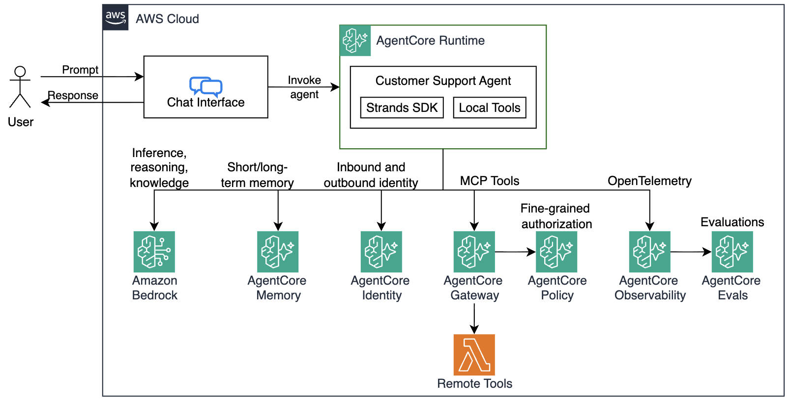

# Building AI Agents on Amazon Bedrock AgentCore - Workshop

## Overview

[Amazon Bedrock AgentCore](https://aws.amazon.com/bedrock/agentcore/) helps you deploying and operating AI agents securely at scale - using any framework and model. It provides you with the capability to move from prototype to production faster.

In this workshop, you will go through an end-to-end journey from prototype to production building a Customer Support Agent. You will use the [Strands Agents SDK](https://strandsagents.com/), a simple-to-use, code-first framework for building agents and the [Amazon Nova 2 Lite](https://aws.amazon.com/nova) model from [Amazon Bedrock](https://aws.amazon.com/bedrock). 



> AgentCore supports using any model and agentic framework to run your agents, such as Strands, LangChain, LangGraph and more. While Strands SDK is used for this workshop, the concepts can be applied to any other frameworks and models as well.

## Workshop Journey

* [Module 0: Installing pre-requisites](./m00-bootstrap.md)
* [Module 1: Create local Agent prototype - Build a functional customer support agent](./m01-local-agent.md)
* [Module 2: Adding a Knowledge Base - Grounding agent responses in factual data](./m02-knowledge-base.md)
* [Module 3: Enhancing your agent with Memory - Add conversation context and personalization](./m03-memory.md)
* [Module 4: Scale with Gateway & Identity - Securely share tools across agents](./m04-gateway.md)
* [Module 5: Running in cloud - Deploying, scaling, and monitoring your agent on AgentCore Runtime ](./m05-runtime.md)


```
TBD Module 4: Deploy to Production - Use AgentCore Runtime with observability
TBD Module 5: Evaluate Agent Performance - Monitor quality with online evaluations
TBD Module 6: Build User Interface - Create a customer-facing application
```

## Let's get started!

Nexs step - [Module 0: Installing pre-requisites](./m00-bootstrap.md)
