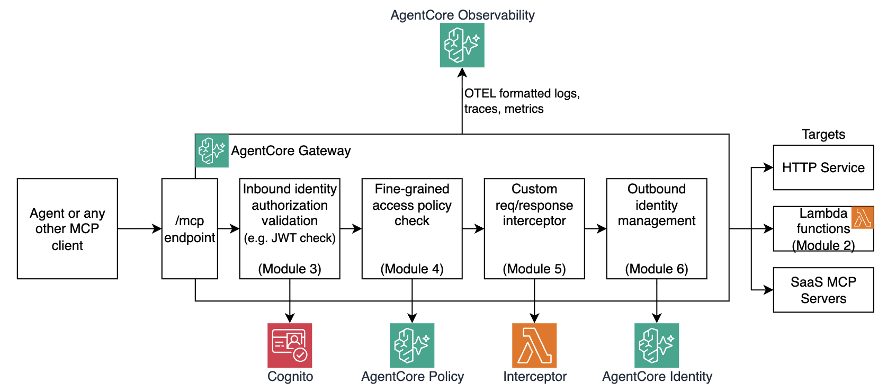

# Module 1: Understanding AgentCore Gateway

Before you provision any cloud resources, this module builds a mental model of what AgentCore Gateway is and how its parts fit together. It is a conceptual module - no AWS resources are deployed yet.

## What are you building?

Throughout this workshop you will build the backend for a pizza shop AI ordering assistant. Two tools, implemented as Lambda functions, will be exposed via the gateway:

| Tool | What it does |
|---|---|
| `get-menu` | Returns the current menu with pizza names and prices |
| `create-order` | Takes a `pizzaId` argument and returns the order confirmation |

By the end of this workshop you will have:

- Both tools accessible via MCP, secured with inbound JWT and outbound IAM, governed by access policies
- An interceptor that inspects and modifies every request and response
- A Strands agent that can submit pizza orders using those tools

## What are the building blocks of AgentCore Gateway?

**Gateway** is a component of Amazon Bedrock AgentCore that allows you to expose a wide variety of backend targets (HTTP endpoints, Lambda functions, MCP servers) as [Model Context Protocol (MCP)](https://modelcontextprotocol.io/) endpoints. Any agentic framework that speaks MCP — Strands, LangChain, LangGraph, Claude Desktop, and others — can discover and call these tools through a secured gateway URL.

Let's examine several of Gateway's core concepts. All of them are mapped to the above diagram.

### Gateway

A **Gateway** is the top-level construct. It provides an HTTPS endpoint (`gateway_url`) and handles:

- **Protocol translation** — Converts MCP JSON-RPC calls to the target's native invocation format
- **Authentication** — Validates the caller's inbound identity and authenticates to outbound downstream targets — the agent never holds credentials for the target
- **Policy enforcement** — Evaluates fine-grained access policies before forwarding requests to targets
- **Interceptors** — Allows you to intercept, inspect, and modify MCP requests and responses
- **Observability** — Emits structured telemetry to CloudWatch for every tool invocation, giving you an audit trail and latency visibility out of the box

### Gateway Targets

A **Target** is a backend resource registered with a Gateway, such as an HTTP endpoint or a Lambda function. Each target carries:

- A **tool schema** — the tool name, description, and input parameters that Gateway publishes via MCP's `tools/list`. For HTTP and MCP targets this can be auto-discovered; for Lambda targets you define it inline.
- A **credential provider** — how Gateway authenticates to the target (e.g. IAM role, API key, or OAuth2 token)

### Request authorizers

An **authorizer** is the inbound authentication mechanism attached to a Gateway. It runs first — before interceptors, before policy evaluation, before any target is invoked. AgentCore supports four types: `None`, `JWT`, `AWS IAM`, and `Authenticate only`.

This workshop starts with `None` in Module 2 and upgrades to `JWT` with Amazon Cognito in Module 3.

### Interceptors

An **Interceptor** is an optional Lambda function that runs on every request and/or response. It can read headers, inspect the MCP payload, modify arguments, enrich responses, or short-circuit with a synthetic response entirely. The tool Lambdas themselves are never changed.

You will build a pass-through and a mutating interceptor in Module 5.

### Policy Engine

A **Policy Engine** is an optional component that evaluates fine-grained authorization policies before each tool call. Without any `permit` policy, the engine denies everything by default. Policies can be scoped to specific tools, JWT claims, or even the arguments passed to a tool.

You will progressively strengthen security posture by adding policies in Module 4. 

### Outbound identity

When the Gateway invokes a downstream target, it authenticates using a **credential provider** — either the Gateway's IAM role (for Lambda) or an OAuth2 token. The calling agent never holds credentials for the downstream target.

The companion to this is the **Token Vault**: AgentCore securely stores OAuth2 `client_id`/`client_secret` pairs so agents never hold long-lived secrets either. You will set this up in Module 6.

## Next step

Enough talking, let's start building! Head to [Module 2](m02-first-tool.md) to deploy the gateway and your first tool.
