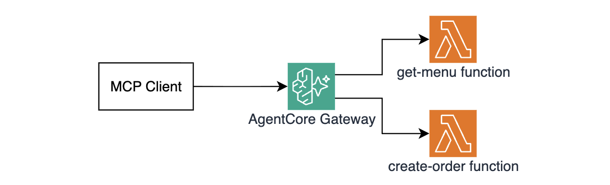
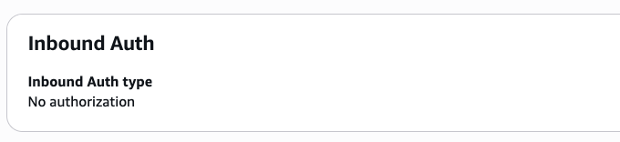
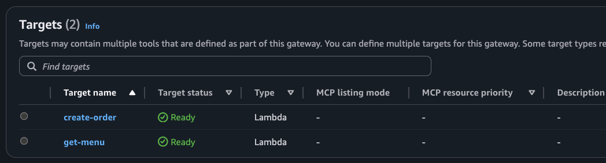
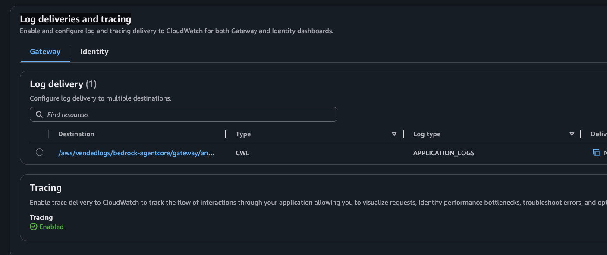

# Module 2: Your first tool - no auth required

In this module you will deploy an AgentCore Gateway with two pizza tools - `get-menu` and `create-order` - with no authentication for now. By the end of this module you will be calling both tools via MCP using `curl`.

## What you will build



> This module is intentionally not enforcing authentication so you can focus on the Gateway and MCP mechanics without additional setup. You will switch to `CUSTOM_JWT` in the next module. 

## Step 1: Examine the Lambda functions

1. Explore the `Get Menu` implementation in `src/lambdas/get-menu/index.js`. It returns a static menu:

    ```js
    const menu = [
        { id: 1, name: "Margherita",      price: 12.99 },
        { id: 2, name: "Pepperoni",       price: 14.99 },
        { id: 3, name: "Four Cheese",     price: 15.99 },
        { id: 4, name: "BBQ Chicken",     price: 16.99 },
        { id: 5, name: "Pineapple Deluxe", price: 15.49 },
        { id: 6, name: "Veggie Supreme",  price: 14.99 },
    ];

    export const handler = async () => {
        return { menu };
    };
    ```

2. Explore the `Create Order` implementation in `src/lambdas/create-order/index.js`. It looks up a pizza by `pizzaId` and returns an order confirmation:

    ```js
    export const handler = async (event) => {
        const pizzaId = event.pizzaId;
        const pizza = menu.find((p) => p.id === pizzaId);
        if (!pizza) return { error: `Pizza with id ${pizzaId} not found` };

        return {
            orderId: `ORDER-${crypto.randomUUID()}`,
            date: new Date().toISOString(),
            item: pizza.name,
            total: pizza.price,
        };
    };
    ```

These are two plain Lambda functions. There's absolutely nothing special about them - they know nothing about MCP or AgentCore. The Gateway fully handles protocol translation.

## Step 2: Examine the Gateway Terraform configuration

Open `terraform/gateway.tf`. There are two key things to notice:

1. **Gateway resource** has `authorizer_type = "NONE"`. This means any caller can reach the tools without any authorization requirements:

    ```hcl
    resource "awscc_bedrockagentcore_gateway" "pizza_shop" {
        name = "${local.project_name}"
        role_arn      = aws_iam_role.gateway.arn
        protocol_type = "MCP"

        # Any caller can reach the tools, no auth required
        authorizer_type = "NONE"

        ...REDACTED...
    }
    ```

2. **Target + tool schema** - the `inline_payload` block at line 55 is what MCP clients see when they call `tools/list`. It defines the tool name, description, and input parameters:

    ```hcl
    resource "aws_bedrockagentcore_gateway_target" "get_menu" {
        ...REDACTED...
    
        target_configuration {
            mcp {
                lambda {
                    lambda_arn = aws_lambda_function.get_menu.arn

                    tool_schema {
                        inline_payload {
                            name        = "get-menu"
                            description = "Returns the current pizza menu with item IDs, names, and prices"

                            input_schema {
                                type = "object"
                            }
                        }
                    }
                }
            }
        }
    }
    ```

## Step 3: Deploy the gateway

1. Run the following command in VS Code Terminal to deploy Lambda functions and Gateway:

    ```bash
    make deploy-infra
    ```

    This will:
    - Package both Lambda functions as ZIP archives in `tmp/`
    - Deploy both Lambda functions to AWS
    - Create an IAM role for the Gateway with permissions to invoke Lambdas and send telemetry to CloudWatch.
    - Create the AgentCore Gateway with `authorizer_type = "NONE"`
    - Register both Lambda functions as Gateway targets with their tool schemas
    - Set up CloudWatch log and traces delivery
    - Write `tmp/gateway_url.txt` so subsequent `curl` commands can find the endpoint

    Deployment should take about 2–3 minutes.

    > If you're seeing an error failing to create a `CloudWatch Logs Delivery`, wait for a minute and retry running `make deploy-infra`. This error indicates that Transactional Search is still being enabled in the account. 

1. Verify the deployment using AWS console - open the [Amazon Bedrock AgentCore console](https://us-east-1.console.aws.amazon.com/bedrock-agentcore/), go to **Build → Gateway**, and confirm you see your gateway with status **Ready**. 

    > Make sure the `North Virginia (us-east-1)` region is selected. 

1. Click into the gateway and verify:
    - Inbound auth is configured as **No authorization**

    

    - Both targets appear under **Targets** with status **Ready**

    

    - **Log deliveries and tracing** section shows a log delivery destination and Tracing as **Enabled**

    

The gateway and tools are deployed! Let's start calling them via MCP.

## How the MCP protocol works

AgentCore Gateway exposes the [MCP over Streamable HTTP](https://modelcontextprotocol.io/specification/2025-03-26/basic/transports#streamable-http). All calls are JSON-RPC 2.0 `POST` requests to the same gateway URL.

| Method | Purpose |
|---|---|
| `tools/list` | Discover all tools registered on the gateway |
| `tools/call` | Invoke a specific tool |

Tool names follow the pattern `{targetName}___{toolName}` (triple underscore). A target named `get-menu` with tool `get-menu` becomes `get-menu___get-menu`. You will see this in action below.

## Step 4: Discover tools via MCP

Run the following command in VS Code Terminal:

```bash
make list-tools
```

This runs the following `curl` command:

```text
curl -s \
    -X POST https://{gateway-id}.gateway.bedrock-agentcore.us-east-1.amazonaws.com/mcp \
    -H "Content-Type: application/json" \
    -H "Authorization: Bearer " \
    -d '{
      "jsonrpc": "2.0",
      "id": 1,
      "method": "tools/list"
    }' | jq .
```

Two important things to note:
1. Bearer token (Authorization header) is empty. This is OK since you haven't enabled any authorization checks on the gateway yet. 
2. The payload is requesting the list of tools (`"method":"tools/list"`)

Expected response:

```json
{
  "jsonrpc": "2.0",
  "id": 1,
  "result": {
    "tools": [
      {
        "name": "get-menu___get-menu",
        "description": "Returns the current pizza menu with item IDs, names, and prices",
        "inputSchema": {
          "type": "object"
        }
      },
      {
        "name": "create-order___create-order",
        "description": "Place a pizza order. Always call get-menu first to confirm the pizzaId.",
        "inputSchema": {
          "type": "object",
          "properties": {
            "pizzaId": {
              "type": "integer",
              "description": "The ID of the pizza to order (from get-menu)"
            }
          },
          "required": ["pizzaId"]
        }
      }
    ]
  }
}
```

> Notice the tool names follow the `{targetName}___{toolName}` pattern.

As expected, the MCP tools list functionality is working properly!

## Step 5: Call the tools

**Get the menu:**

```bash
make get-menu
```

This runs the following `curl` command:

```
curl -s \
    -X POST https://{gateway-id}.gateway.bedrock-agentcore.us-east-1.amazonaws.com/mcp \
    -H "Content-Type: application/json" \
    -H "Authorization: Bearer " \
    -d '{
      "jsonrpc": "2.0",
      "id": 1,
      "method": "tools/call",
      "params": {
        "name": "get-menu___get-menu",
        "arguments": {}
      }
    }' | jq .
```

Expected response:

```json
{
  "jsonrpc": "2.0",
  "id": 1,
  "result": {
    "isError": false,
    "content": [
      {
        "type": "text",
        "text": "{\"menu\":[{\"id\":1,\"name\":\"Margherita\",\"price\":12.99},{\"id\":2,\"name\":\"Pepperoni\",\"price\":14.99},{\"id\":3,\"name\":\"Four Cheese\",\"price\":15.99},{\"id\":4,\"name\":\"BBQ Chicken\",\"price\":16.99},{\"id\":5,\"name\":\"Pineapple Deluxe\",\"price\":15.49},{\"id\":6,\"name\":\"Veggie Supreme\",\"price\":14.99}]}"
      }
    ]
  }
}
```

As expected, the pizza menu MCP tool is working properly!

**Place an order for pizza #2 (Pepperoni):**

```bash
make create-order pizzaId=2
```

This runs the following `curl` command:

```text
curl -s \
    -X POST https://{gateway-id}.gateway.bedrock-agentcore.us-east-1.amazonaws.com/mcp \
    -H "Content-Type: application/json" \
    -H "Authorization: Bearer " \
    -d '{
      "jsonrpc": "2.0",
      "id": 1,
      "method": "tools/call",
      "params": {
        "name": "create-order___create-order",
        "arguments": { "pizzaId": 2 }
      }
    }' | jq .
```

Expected response:

```json
{
  "jsonrpc": "2.0",
  "id": 1,
  "result": {
    "isError": false,
    "content": [
      {
        "type": "text",
        "text": "{\"orderId\":\"ORDER-a1b2c3d4-...\",\"date\":\"2026-05-29T12:00:00.000Z\",\"item\":\"Pepperoni\",\"total\":14.99}"
      }
    ]
  }
}
```

As expected, the create order MCP tool is working properly!

## How it works under the hood

1. `curl` sends a JSON-RPC 2.0 `POST` to the gateway URL
2. Gateway receives it, checks `authorizer_type = "NONE"` and lets the request through (no authorization is enforced)
3. Gateway looks up the target matching `create-order___create-order`
4. Gateway assumes the IAM role attached to the gateway and invokes the Lambda function
5. Lambda returns `{ orderId, date, item, total }`
6. Gateway wraps it in an MCP `tools/call` response

The Lambda function is invoked with the `arguments` from the MCP call mapped directly as the event payload - `event.pizzaId` comes directly from `params.arguments.pizzaId`.

## Congratulations!

You have:
- Deployed a working AgentCore Gateway with two Lambda-backed MCP tools
- Called both tools via MCP from the command line
- Seen how the inline tool schema controls what MCP clients discover

The gateway is currently open - anyone with the URL can call your pizza tools. Let's fix that.

## Next step

Head to [Module 3](m03-jwt-auth.md) to add JWT authentication with Amazon Cognito.
