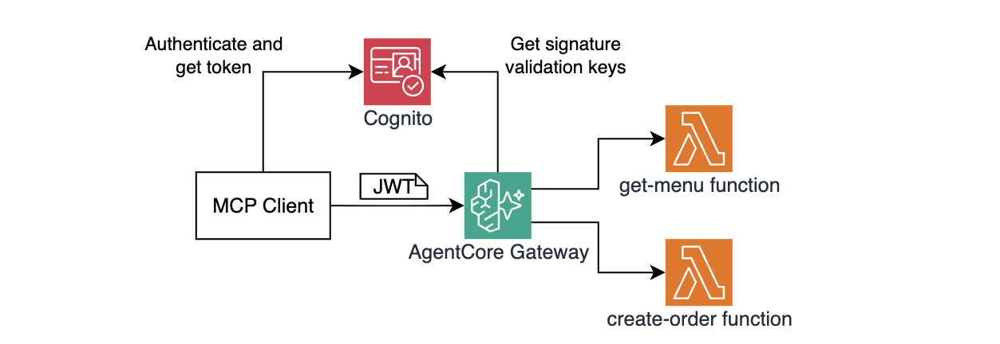
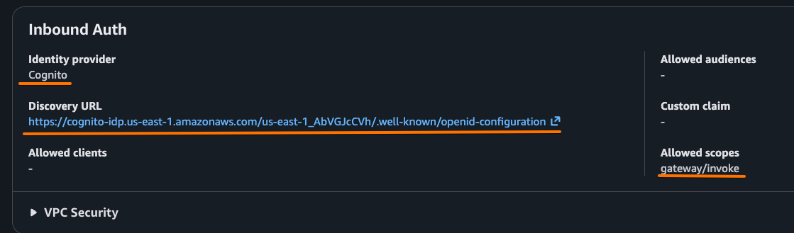

# Module 3: Adding JWT authentication

In Module 2, your gateway was wide open - anyone with the URL could call your pizza tools. But nobody likes paying for a stranger's pizza, right? In this module you will secure inbound access with **JWT authentication** using Amazon Cognito as the identity provider.

## Architecture

In this module you will implement the following architecture:



## Why JWT authentication matters

Without authentication, any process that discovers your gateway URL can read your menu and place orders. You have no way of controlling who calls your tools or auditing who placed orders. With `JWT` authorization, the Gateway validates an inbound OAuth2 Bearer token on every request. Callers without a valid token are rejected before any tool is ever invoked.

AgentCore supports four inbound authorizer types:

- `None` (which you used in the previous module) is not recommended, unless you explicitly want your MCP endpoint not to require authorization.
- `CUSTOM_JWT` (which you will use in this module) works with any OIDC-compliant identity provider such as Cognito, Okta, Auth0, and others. 
- `AWS IAM` is the right choice when your callers are other AWS services or IAM roles authenticating with SigV4. 
- `Authenticate only` validates the JWT identity but delegates scope enforcement to the downstream target - useful for HTTP targets that implement their own authorization. 

The changes you're about to implement result in the following enhancements to your agent:

| Before this module | After (this module) |
|---|---|
| `authorizer_type = "NONE"` | `authorizer_type = "CUSTOM_JWT"` |
| Any caller can list and call tools | Only callers with a valid JWT can proceed |
| No identity context | Gateway validates issuer, audience, and scopes |

The Gateway uses the Cognito User Pool's **OIDC discovery endpoint** (`/.well-known/openid-configuration`) to fetch the public keys needed to validate tokens. You never need to configure the keys manually.

Let's start implementing!

## Step 1: Examine the Cognito Terraform configuration

Open `terraform/cognito-module3.tf`. The key resources are:

**Cognito User Pool** - the identity store:

```hcl
resource "aws_cognito_user_pool" "this" {
  name = local.project_name
}
```

**Resource Server + scope** - defines the OAuth2 audience and scopes clients can request:

```hcl
resource "aws_cognito_resource_server" "gateway" {
  identifier = "gateway"
  scope {
    scope_name = "invoke"
  }
}
```

The full scope name is `gateway/invoke` (resource server identifier + scope name). 

> Note that in this module you'll use one scope for all requests. In following modules you'll implement a more fine-grained scope-based authorization. 

**App Client** - the credential pair your MCP Client will use:
```hcl
resource "aws_cognito_user_pool_client" "mcp_client" {
    name         = "${local.project_name}-mcp-client"
    user_pool_id = aws_cognito_user_pool.this.id

    generate_secret                      = true
    allowed_oauth_flows_user_pool_client = true
    allowed_oauth_flows                  = ["client_credentials"]
    allowed_oauth_scopes                 = ["gateway/invoke"]
    supported_identity_providers         = ["COGNITO"]
}
```

`client_credentials` grant is used here for simplicity - the agent authenticates with its own `client_id` + `client_secret`. AgentCore also supports other OAuth2 grants: `authorization_code` with PKCE, token exchange, and on-behalf-of flows for more advanced identity scenarios.

## Step 2: Update the gateway configuration to use a custom JWT authorizer 

1. Open `terraform/gateway.tf` and make two changes to the `awscc_bedrockagentcore_gateway` resource:

    - Comment out or remove `authorizer_type = "NONE"`.

    - Uncomment the JWT block below it:
    ```hcl
    authorizer_type = "CUSTOM_JWT"
    authorizer_configuration = {
        custom_jwt_authorizer = {
            discovery_url  = local.cognito_discovery_url
            allowed_scopes = ["gateway/invoke"]
        }
    }
    ```
    
    - This is what gateway resource should look like after your changes:

    ```hcl
    resource "awscc_bedrockagentcore_gateway" "pizza_shop" {
        name          = "${local.project_name}"
        description   = "MCP gateway for the pizza shop ordering tools"
        role_arn      = aws_iam_role.gateway.arn
        protocol_type = "MCP"

        authorizer_type = "CUSTOM_JWT"
        authorizer_configuration = {
            custom_jwt_authorizer = {
                discovery_url  = local.cognito_discovery_url
                allowed_scopes = ["gateway/invoke"]
            }
        }

        ...REDACTED...
    }
    ```

1. Deploy the changes:

    ```bash
    make redeploy-gateway
    ```

    > AgentCore intentionally does not allow updating `authorizer_type` in-place: switching from an authenticated mode to `NONE` (or vice versa) is a security-sensitive change that should be explicit and auditable, not a silent field update. `redeploy-gateway` uses `terraform apply -replace` which destroys the old gateway and creates a fresh one with the new authorizer configuration.

1. Once deployment completes, verify the updates in AWS console - open the [Amazon Bedrock AgentCore console](https://us-east-1.console.aws.amazon.com/bedrock-agentcore/), go to **Build → Gateways**, click on your gateway and confirm it shows Inbound Auth identity provider as **Cognito**.

    

## How the gateway validates the JWT

1. On every request, Gateway reads the `Authorization: Bearer <jwt>` HTTP header
2. Gateway fetches the OIDC discovery document from the `discovery_url` you configured (Cognito publishes this at `/.well-known/openid-configuration`)
3. Gateway downloads the public keys from the `jwks_uri` in that document
4. Gateway verifies the JWT signature, expiry (`exp`), issuer (`iss`), and that the token contains all `allowed_scopes`
5. If any check fails - the gateway returns authorization error
6. If all checks pass - the gateway forwards the request to the target Lambda

> Note: Token signature validation keys are cached - Gateway does not call Cognito on every single request.

## Step 3: Try calling without a token

At this point, you still haven't obtained an access token. Try invoking the Gateway without it first. Run the following command in VS Code Terminal:

```bash
make list-tools
```

You can immediately see that, as expected, the gateway returns authorization failure:

```json
{
  "jsonrpc": "2.0",
  "id": 0,
  "error": {
    "code": -32001,
    "message": "Invalid Bearer token"
  }
}
```

The gateway rejected the request before forwarding it to Lambda targets. 

## Step 4: Fetch a Cognito token

```bash
make get-token
```

This calls the Cognito token endpoint using the `client_credentials` grant and saves the resulting JWT to `tmp/access_token.txt`. Output looks like:

```text
> COGNITO_TOKEN_ENDPOINT=https://xxxx.auth.us-east-1.amazoncognito.com/oauth2/token
> COGNITO_CLIENT_ID=abc123...
> COGNITO_SCOPE=gateway/invoke

Retrieved access token: eyJhbGciOiJSUzI1NiIsInR5cCI6IkpXVCJ9...
Token saved to ./tmp/access_token.txt
```

## Step 5: Call with a valid token

Run the following command again, this time it will use the access token you retrieved in the previous step:

```bash
make list-tools
```

This command reads `tmp/access_token.txt` and adds `Authorization: Bearer <token>` HTTP header to the request. Expected response is the same tool list as Module 2 - but now only authorized callers can see it.

Try getting the menu:

```bash
make get-menu
```

And placing an order to confirm the full flow works:

```bash
make create-order pizzaId=3
```

Your authenticated pizza order was successfully created! Expected response:

```json
{
  "jsonrpc": "2.0",
  "id": 1,
  "result": {
    "isError": false,
    "content": [
      {
        "type": "text",
        "text": "{\"orderId\":\"ORDER-74e5295f-8c95-4d2c-82ec-e5e8012ccd3d\",\"date\":\"2026-06-02T01:10:59.868Z\",\"item\":\"Four Cheese\",\"total\":15.99}"
      }
    ]
  }
}
```

## Congratulations!

You've added your first security layer! Now your pizza gateway requires a valid Cognito JWT on every request.

- **Cognito User Pool** acts as the OAuth2 identity provider
- Access token is retrieved using the `client_credentials` OAuth2 grant
- **`CUSTOM_JWT` authorizer** validates tokens and checks scopes

## Next step

Head to [Module 4](m04-policies.md) to add fine-grained Cedar authorization policies.
