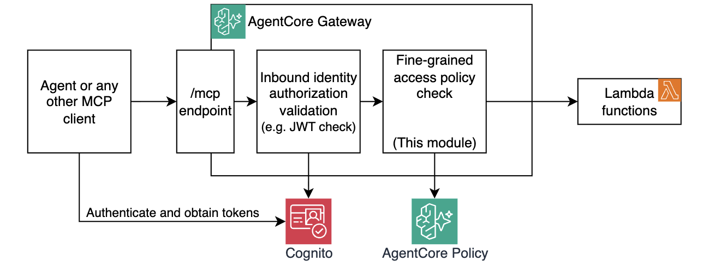

# Module 4: Adding policies

JWT authentication tells you **who** is calling. OAuth2 scopes let you go one step further — you can restrict a token to a set of allowed operations (e.g. `gateway/get_menu` but not `gateway/create_order`). For many use cases, that is enough.

But scopes are coarse-grained. They carry high-level intent — "this client can place orders" — but they know nothing about the request payload. There is no OAuth2 scope for "this user may only order pizzas that are not pineapple." For that kind of fine-grained authorization validation you need a policy engine that can inspect the actual tool names and arguments at request time.

In this module you attach a **Policy Engine** to the gateway and write [Cedar](https://www.cedarpolicy.com/) authorization policies that control exactly which tools each caller can invoke — and under what conditions, including rules based on the arguments passed to a tool in request body.

## Architecture

In this module you will implement the following architecture:



## Policy Engine overview

AgentCore's Policy Engine evaluates Cedar policies on every tool call. The default behaviour is **deny-all**: with no permit policies, nothing gets through.

```
JWT validated ✓
        │
        ▼
Policy Engine
  ├─ permit(principal, action=="get-menu___get-menu", resource==gateway) ?
  ├─ permit(principal, action=="create-order___create-order", resource==gateway)
  │         when { principal has scope "gateway/create_order" } ?
  └─ forbid(principal, action=="create-order___create-order", resource==gateway)
            when { context.input.pizzaId == 5 } ?    ← forbid wins
        │
        ▼
   Tool Lambda (only if permitted AND not forbidden)
```

Key rule: **`forbid` always overrides `permit`**. A single `forbid` policy can block a request even if multiple `permit` policies would allow it.

## Cedar concepts used in this module

| Concept | Syntax | Meaning |
|---|---|---|
| Action name | `AgentCore::Action::"get-menu___get-menu"` | Matches a specific tool call |
| Resource (gateway) | `AgentCore::Gateway::"<gateway_arn>"` | Scoped to a specific gateway |
| JWT scope tag | `principal.getTag("scope")` | The scopes from the Bearer token |
| Tool argument | `context.input.pizzaId` | The argument passed to the tool |
| Permit | `permit(principal, action, resource)` | Allow if conditions met |
| Forbid | `forbid(principal, action, resource)` | Deny even if permit would allow |

## Step 1: Upgrade to two Cognito clients

Up to now, a single Cognito client (`agent`) had the `gateway/invoke` scope. In this module you replace it with **two clients** with different scopes:

- **client1** — has only `gateway/get_menu` — can view the menu but cannot order
- **client2** — has both `gateway/get_menu` and `gateway/create_order` — full access

Open `terraform/cognito-module4.tf` and **uncomment the entire file**. This adds `client1` and `client2` alongside the existing `mcp_client` from Module 3 — no changes to `cognito-module3.tf` are needed.

Also update `terraform/gateway.tf` — inside the `custom_jwt_authorizer` block, update `allowed_scopes` and add `allowed_clients`:

```hcl
authorizer_configuration {
  custom_jwt_authorizer {
    discovery_url  = local.cognito_discovery_url
    allowed_scopes = ["gateway/get_menu"]
    allowed_clients = [
      aws_cognito_user_pool_client.client1.id,
      aws_cognito_user_pool_client.client2.id,
    ]
  }
}
```

`allowed_scopes` here means "the token must contain AT LEAST this scope" to pass the JWT check. The `gateway/create_order` scope restriction is enforced later by Cedar policy.

## Step 2: Enable the Policy Engine

Open `terraform/policies.tf` and **uncomment the `awscc_bedrockagentcore_policy_engine` resource** at the top of the file.

Open `terraform/gateway.tf` and make two changes:

1. **Uncomment** the `gateway_policy_engine` IAM policy — the gateway role needs permission to call the policy engine.

2. **Uncomment** the `policy_engine_configuration` block inside the gateway resource:

    ```hcl
    policy_engine_configuration = {
      arn  = awscc_bedrockagentcore_policy_engine.pizza_shop.policy_engine_arn
      mode = "ENFORCE"
    }
    ```

    > Start with `mode = "LOG_ONLY"` to observe policy decisions in CloudWatch without blocking requests. Switch to `"ENFORCE"` once you are confident in your policies.

## Step 3: Deploy

```bash
make deploy-infra
```

This deploys the new Cognito clients, creates the Policy Engine, and updates the gateway configuration.

Let's start testing!

## Step 4: Confirm default deny

Get a token for either client and try to list tools:

```bash
make get-client1-token
make list-tools
```

Expected response:

```json
{
  "jsonrpc": "2.0",
  "id": 1,
  "error": {
    "code": -32003,
    "message": "Access denied"
  }
}
```

The Policy Engine is active, there are no permit policies, so everything is denied.

## Step 5: Add permit_all (illustration)

Open `terraform/policies.tf` and uncomment the `permit_all` policy resource:

```hcl
resource "awscc_bedrockagentcore_policy" "permit_all" {
  definition = {
    cedar = {
      statement = "permit(principal, action, resource is AgentCore::Gateway);"
    }
  }
}
```

Deploy and test — both clients should now be able to call both tools. This is overly permissive; we will narrow it in the next step.

## Step 6: Permit by tool

Comment out `permit_all`. Uncomment `allow_get_menu`:

```hcl
permit(
  principal,
  action == AgentCore::Action::"get-menu___get-menu",
  resource == AgentCore::Gateway::"<gateway_arn>"
);
```

Deploy and test:

```bash
make get-client1-token && make get-menu       # ✅ allowed
make get-client1-token && make create-order pizzaId=1   # ❌ denied
make get-client2-token && make create-order pizzaId=1   # ❌ denied (no create_order permit yet)
```

## Step 7: Scope-based permit for create-order

Uncomment `allow_create_order_with_scope`:

```hcl
permit(
  principal,
  action == AgentCore::Action::"create-order___create-order",
  resource == AgentCore::Gateway::"<gateway_arn>"
)
when {
  principal.hasTag("scope") &&
  principal.getTag("scope") like "*gateway/create_order*"
};
```

`principal.getTag("scope")` reads the `scope` claim from the validated JWT. The `like` operator with wildcards checks if the string contains `gateway/create_order`.

Deploy and test:

```bash
make get-client1-token && make create-order pizzaId=1   # ❌ denied (no create_order scope)
make get-client2-token && make create-order pizzaId=1   # ✅ allowed
```

client1 and client2 now have different capabilities based on their JWT scopes, enforced at the policy layer.

## Step 8: Forbid pineapple

Uncomment `forbid_pineapple`:

```hcl
forbid(
  principal,
  action == AgentCore::Action::"create-order___create-order",
  resource == AgentCore::Gateway::"<gateway_arn>"
)
when {
  context.input.pizzaId == 5
};
```

`context.input` exposes the tool arguments that were passed to the Lambda. This allows policies to make decisions based on the actual data being sent, not just who is calling.

Deploy and test:

```bash
make get-client2-token
make create-order pizzaId=3    # ✅ Four Cheese — allowed
make create-order pizzaId=5    # ❌ Pineapple Deluxe — forbidden
```

Expected response for pizzaId=5:

```json
{
  "jsonrpc": "2.0",
  "id": 1,
  "error": {
    "code": -32003,
    "message": "Access denied"
  }
}
```

The `forbid` policy blocks the request even though `allow_create_order_with_scope` would permit it. **Forbid always wins.**

## Summary: policy progression

| Step | Policies active | client1 (get_menu only) | client2 (get_menu + create_order) |
|---|---|---|---|
| 4 | None (engine on, no policies) | All denied | All denied |
| 5 | permit_all | Full access | Full access |
| 6 | allow_get_menu | Menu only | Menu only |
| 7 | allow_get_menu + allow_create_order_with_scope | Menu only | Menu + Orders |
| 8 | above + forbid_pineapple | Menu only | Menu + Orders (no pizza #5) |

## Congratulations!

Your gateway now enforces fine-grained authorization using Cedar policies.

- **Policy Engine** evaluates policies before every tool invocation
- **`permit` by action** controls which tools are accessible at all
- **`permit` with scope conditions** ties permissions to JWT claims
- **`forbid` with `context.input`** enforces business rules on tool arguments

## Next step

Head to [Module 5](m05-interceptors.md) to add a Lambda interceptor that can inspect and transform requests and responses.
