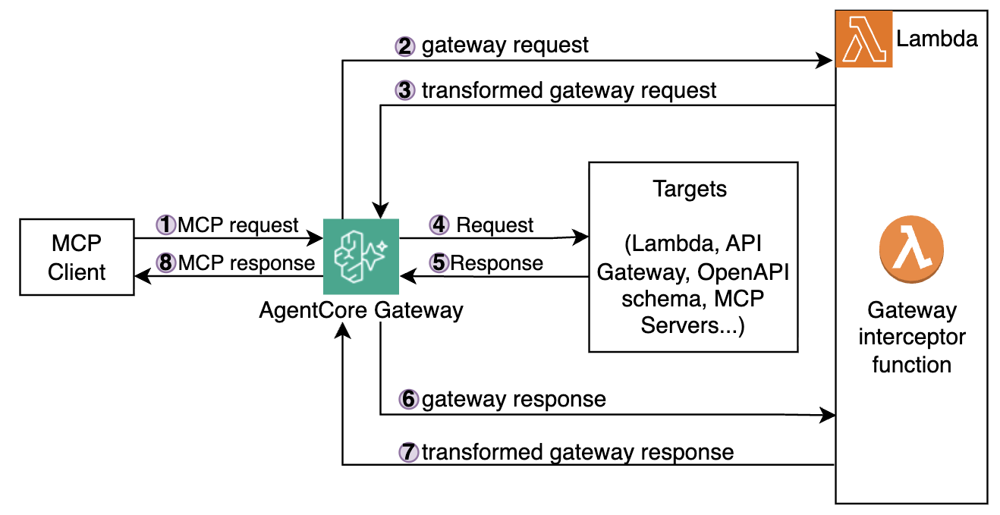
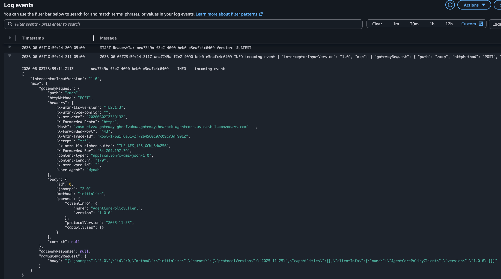

# Module 5: Adding interceptors

In the previous module you defined declarative fine-grained access policies - rules that the gateway evaluates automatically on every request. But what if you need even more flexibility than a policy language can offer? For example, what if you need to
- Run arbitrary code on each incoming MCP request or outgoing MCP response
- Validate requests against existing 3rd party systems
- Inject additional context into tool arguments before they reach targets
- Enrich a response with live data from another service
- Short-circuit a request entirely and return a synthetic response without ever invoking the tool

That is exactly what **Gateway Interceptors** give you - a programmable hook that runs natively inside the gateway flow.

## Architecture

In this module you will extend your gateway implementation and add the new Gateway Interceptor component:



## What interceptors can do

| Use case | Request and/or Response? |
|---|---|
| Validate custom headers | REQUEST |
| Log or audit tool calls | REQUEST and RESPONSE |
| Inject context into tool arguments | REQUEST |
| Short-circuit with a synthetic response | REQUEST |
| Enrich or redact tool output | RESPONSE |
| Add metadata (currency, units, timestamp) | RESPONSE |

## How do Interceptors work

Interceptor is essentially a Lambda function that you Gateway invokes **before** forwarding the request to the tool (Request Interceptor) and/or **after** receiving the tool response (Response Interceptor).

Both interceptor types receive request/response payloads, optionally make modifications, and return them for gateway to proceed processing. 

A Request Interceptor has two return options:
- Return a `transformedGatewayRequest` - the gateway forwards it to the tool Lambda as-is. Use this to modify or enrich the incoming request.
- Return a `transformedGatewayResponse` - the gateway sends that directly back to the caller and **skips the tool invocation entirely**. Use this for short-circuiting: caching, synthetic responses, calling external systems, or complex validations that go beyond what Cedar policies can express.

## Interceptor event format

Your interceptor Lambda receives an event with this structure:

**REQUEST** (before request is forwarded to the tool):
```json
{
  "interceptorInputVersion": "1.0",
  "mcp": {
    "gatewayRequest": {
      "path": "/mcp",
      "httpMethod": "POST",
      "headers": { "authorization": "Bearer ...", "mcp-session-id": "..." },
      "body": {
        "jsonrpc": "2.0",
        "method": "tools/call",
        "params": {
          "name": "create-order___create-order",
          "arguments": { "pizzaId": 5 }
        }
      }
    },
    "gatewayResponse": null
  }
}
```

**RESPONSE** (after tool response is received, but not yet returned to the client):
```json
{
  "interceptorInputVersion": "1.0",
  "mcp": {
    "gatewayRequest": { ... },
    "gatewayResponse": {
      "statusCode": 200,
      "body": {
        "jsonrpc": "2.0",
        "result": {
          "content": [{ "type": "text", "text": "{\"orderId\":\"ORD-123\",\"item\":\"Margherita\",\"total\":12.99}" }]
        }
      }
    }
  }
}
```

## Examine the two interceptor variants

Open `src/lambdas/interceptor/`. There are two handler files:

**`index.js` (pass-through)** - logs the event and returns everything unchanged. Use this to understand what the gateway sends to the interceptor without modifying any traffic.

**`index2.js` (mutating)** - demonstrates two transformations:
- **REQUEST** transformation: if `pizzaId === 5` (Pineapple Deluxe), rewrites it to `pizzaId = 1` (Margherita)
- **RESPONSE** transformation: adds `"currency": "USD"` to every `create-order` response

Let's start implementing!

## Step 1: Attach the interceptor to the Gateway

The interceptor is a regular Lambda function - it just receives a structured event from the gateway rather than being invoked directly. The Terraform configuration for it is already written in `terraform/lambda-interceptor.tf`

1. Examine `terraform/lambda-interceptor.tf`, see the function resource at the bottom of the file. 

1. Open `terraform/gateway.tf`. See the commented out `interceptor_configurations` block that wires the Lambda ARN to the gateway and specifies which interception points to use (`REQUEST`, `RESPONSE`, or both).

1. Uncomment the `interceptor_configurations` block inside the gateway resource:

    ```hcl
    interceptor_configurations = [
      {
        interception_points = ["REQUEST", "RESPONSE"]
        interceptor = {
          lambda = {
            arn = aws_lambda_function.interceptor.arn
          }
        }
        input_configuration = {
          pass_request_headers = true
        }
      }
    ]
    ```

1. Deploy your changes by running the following command:

    ```bash
    make redeploy-gateway
    ```

Once Terraform deployment has completed, let's start testing!

## Step 2: Observe the pass-through interceptor

The pass-through interceptor defined in `src/lambdas/interceptor/index.js` logs the full event it receives from the gateway and returns everything unchanged. This lets you see exactly what the gateway sends - the request structure, headers, and response body - without affecting any traffic.

1. Examine the pass-through interceptor file `src/lambdas/interceptor/index.js`:

    ```js
    export const handler = async (event) => {
    console.log("incoming event", JSON.stringify(event, null, 2));

    let response;

    if (event.mcp.gatewayResponse) {
        console.log("> gateway response intercepted");
        response = {
        interceptorOutputVersion: "1.0",
        mcp: {
            transformedGatewayResponse: {
            statusCode: event.mcp.gatewayResponse.statusCode,
            body: event.mcp.gatewayResponse.body,
            },
        },
        };
    } else if (event.mcp.gatewayRequest) {
        console.log("> gateway request intercepted");
        response = {
        interceptorOutputVersion: "1.0",
        mcp: {
            transformedGatewayRequest: {
            body: event.mcp.gatewayRequest.body,
            },
        },
        };
    }

    console.log("interceptor response", JSON.stringify(response, null, 2));
    return response;
    };
    ```

1. Place an order

    ```bash
    make get-client2-token
    make create-order pizzaId=2
    ```

1.  See the Interceptor logs:
    - Open the [CloudWatch console](https://console.aws.amazon.com/cloudwatch/)
    - Go to "Logs -> Log Management" 
    - Find `/aws/lambda/<prefix>-pizza-gateway-interceptor`
    - Open the latest log stream
    - You should see the full REQUEST and RESPONSE events logged by `console.log`:

    


The response from the MCP call should be unchanged - you ordered Pepperoni and got Pepperoni.

## Step 3: Switch to the mutating interceptor

Now let's switch to the second handler (`index2.js`) to see how you can use Interceptors to adjust request/response payloads. This handler rewrites `pizzaId=5` to `pizzaId=1` on every incoming order request, and adds `"currency": "USD"` to every order response. The Lambda functions that implement the tools never change - only the interceptor does.

1. Examine the mutating interceptor file `src/lambdas/interceptor/index2.js`. The key difference from the pass-through is the two mutation blocks:

    **Request interceptor** - change Pineapple Deluxe to Margherita:
    ```js
    const args = event.mcp.gatewayRequest.body?.params?.arguments;
    if (args?.pizzaId === 5) { 
      console.log("changing pizzaId=5 to pizzaId=1");
      response.mcp.transformedGatewayRequest.body.params.arguments.pizzaId = 1;
    }
    ```

    **Response interceptor** - add `currency` field to order results:
    ```js
    const parsed = JSON.parse(content[0].text);
    if (parsed.total !== undefined) {
      parsed.currency = "USD";
      response.mcp.transformedGatewayResponse.body.result.content[0].text = JSON.stringify(parsed);
    }
    ```

1. Open `terraform/lambda-interceptor.tf`, find the `aws_lambda_function.interceptor` and update the handler:
    
    From:
    ```hcl
    handler = "index.handler"
    ```
    To:
    ```hcl
    handler = "index2.handler"
    ```

1. Redeploy:
    ```bash
    make deploy-infra
    ```

1. Order Pineapple Deluxe (id=5):
    ```bash
    make create-order pizzaId=5
    ```

    Expected response (note: `item` is now Margherita, not Pineapple Deluxe, and `currency` is present):

    ```json
    {
      "jsonrpc": "2.0",
      "id": 1,
      "result": {
        "isError": false,
        "content": [
          {
            "type": "text",
            "text": { // Showing parsed JSON for clarity
              "orderId": "ORDER-b17caf20-eebc-4e4c-88c7-b93ba9d4244f",
              "date": "2026-06-03T00:27:03.087Z",
              
              // You asked for Pineapple, but got Margherita
              "item": "Margherita", 
              "total": 12.99,
              
              // This was injected by the interceptor
              "currency": "USD" 
            }
          }
        ]
      }
    }
    ```

The interceptor silently swapped your order and enriched the response - the tool Lambda itself was never changed.

## How it works under the hood

1. Gateway receives the `tools/call` request for `create-order` with `pizzaId=5`
2. Gateway validates the JWT - checks signature, expiry, issuer, and that the token contains the required scope
3. Gateway invokes the interceptor Lambda function
4. The interceptor Lambda sees `pizzaId=5` and rewrites it to `pizzaId=1` in the `transformedGatewayRequest`
5. Cedar Policy Engine evaluates the **modified** request - `allow_create_order_with_scope` and permits it (`forbid_pineapple` policy does not match because now `pizzaId=1`)
6. Gateway forwards the request to the `create-order` Lambda function
7. Lambda returns `{ item: "Margherita", total: 12.99, ... }`
8. Gateway invokes the interceptor Lambda function 
9. The interceptor adds `"currency": "USD"` to the response
10. Gateway returns the **enriched** response to the caller

## Congratulations!

You have added a programmatic request/response interceptor to your gateway.

- **Pass-through (`index.handler`)** - observe without modifying
- **Mutating (`index2.handler`)** - rewrite inputs and enrich outputs
- The tool functions themselves were never touched

## Next step

Head to [Module 6](m06-outbound-identity.md) to replace plaintext Cognito credentials with AgentCore's secure Token Vault.
