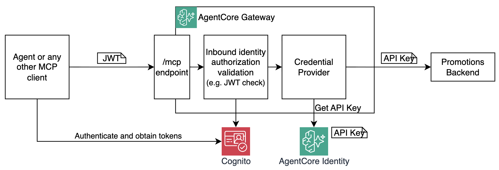
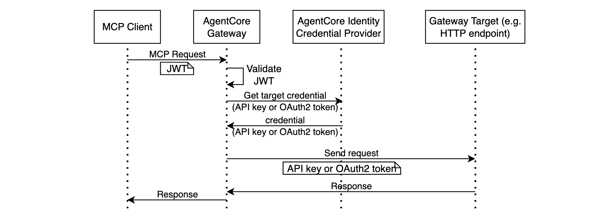

# Module 6: Outbound identity

So far, every security layer you've built has been about controlling *inbound* access — who can reach your gateway and what they can do. But there's an equally important question on the outbound side: when the gateway needs to call a protected downstream service, how do credentials get there securely?

You've already seen one answer to this in `terraform/gateway.tf` - when your target is a Lambda function, the gateway can use its own IAM role to invoke it — no credentials to manage at all:

```hcl
credential_provider_configuration {
  gateway_iam_role {}
}
```

But what if your target is a plain HTTP endpoint protected by an API key or OAuth2? This question is addressed by augmenting **AgentCore Gateway** with **AgentCore Identity**.  

## Architecture

In this module you will extend your implementation with AgentCore Identity providing credentials (API key) for a new gateway target - the Promotions Backend:



## Understanding Credential Providers

A core component of AgentCore Identity is **Credential Provider**. Credential Provider securely stores long-lived secrets, such as API Keys and OAuth2 `client_id` and `client_secret` in an encrypted vault. When your gateway or agent need a secret, they retrieve it from the Credential Provider and inject automatically into outbound target calls. All this without having the secret ever exposed to your agent, MCP client, or even Terraform state.



AgentCore Identity provides two Credential Provider types you can use:

- **API key** - stored in the secure vault, injected as a request header or query parameter.
- **OAuth2** — `client_id` and `client_secret` are stored in the secure vault. When Gateway requests an access token, Credential Provider automatically retrieves (or refreshes) it and returns to the Gateway. The Gateway automatically injects it as a `Bearer` token in the `Authorization` header.

## Two authentication segments

Where you attach a Credential Provider depends on which hop you're securing — there are two to think about:


* **Agent-to-Gateway** — the agent needs to authenticate to the gateway, typically using a short-lived OAuth2 access token. To obtain it, instead of embedding long-lived secrets (e.g. OAuth2 client credentials) in the agent's environment, the agent uses Credential Provider to obtain short-lived credentials (e.g. access token) on-demand. This pattern is out of scope of this workshop, it is covered in detail in the [Building AI Agents with Amazon Bedrock AgentCore workshop](https://github.com/aal80/agentcore-workshops/tree/main/building-ai-agents).

* **Gateway-to-Target (tool)** — the gateway needs to authenticate to a downstream target (e.g. HTTP endpoint) by injecting credentials into each outbound request. You store the long-lived secret in Credential Provider, attach it to the gateway target, and the gateway handles retrieval and injection automatically. This is what you will implement in this module.

Let's start building!

## Step 1: Examine the infrastructure

Open `terraform/promotions-backend.tf`. This file contains everything needed for this module:

1. Simulating the protected **Promotions Backend** - a Lambda function exposed via HTTP API Gateway that returns pizza promotions, but only if the caller presents the correct `x-api-key` header:

    ```js
    export const handler = async (event) => {
        // Reads x-api-key header
        const apiKey = (event.headers ?? {})["x-api-key"];
    
        // Validates if equal to "workshop-demo-key"
        if (apiKey !== "workshop-demo-key") {
            // Returns 401 if not
            return { statusCode: 401, body: JSON.stringify({ message: "Unauthorized" }) };
        }
        
        // Returns promotion text if validation succeeds
        return { statusCode: 200, body: JSON.stringify({ promotions: "Buy two pizzas get one free!" }) };
    };
    ```

1. **The API Key Credential Provider** - stores the key in the Token Vault. `api_key_wo` is write-only: the value is stored in the Credential Provider and never written to Terraform state:

    ```hcl
    resource "aws_bedrockagentcore_api_key_credential_provider" "promotions" {
        name               = "${local.project_name}-promotions"
        api_key_wo         = "workshop-demo-key"
        api_key_wo_version = 1
    }
    ```

1. **The Gateway Target** - registers the promotions backend as an MCP tool using an OpenAPI schema, and wires the credential provider to inject `x-api-key` as a request header on every outbound call:

    ```hcl
    resource "aws_bedrockagentcore_gateway_target" "promotions" {
        name = "promotions"
        gateway_identifier = ...REDACTED...

        # This is where the magic happens
        credential_provider_configuration {
            api_key {
                provider_arn = aws_bedrockagentcore_api_key_credential_provider.promotions.credential_provider_arn
                credential_location       = "HEADER"
                credential_parameter_name = "x-api-key"
            }
        }

        # Declare a new target in the Gateway, this time backend by
        # an HTTP endpoint
        target_configuration {
            mcp {
                open_api_schema {
                    inline_payload {
                        # OpenAPI 3.0 schema describing GET /promotions
                        payload = jsonencode({ ... }) 
                    }
                }
            }
        }
    }
    ```

1. **The Cedar policy** - permits all authenticated principals to call the promotions tool:

    ```hcl
    resource "awscc_bedrockagentcore_policy" "allow_get_promotions" {
    definition = {
        cedar = {
            statement = <<-EOT
                permit(
                principal,
                action == AgentCore::Action::"promotions___get-promotions",
                resource == AgentCore::Gateway::"<gateway_arn>"
                );
            EOT
        }
    }
    }
    ```

## Step 2: Uncomment and deploy

1. Uncomment and save the whole `terraform/promotions-backend.tf` file. 

1. Run the following command in the VS Code Terminal to deploy updates

    ```bash
    make redeploy-gateway
    ```

    This deploys the promotions backend, creates the credential provider (writing the API key to the Token Vault), registers the gateway target, and applies the Cedar policy. The backend URL is written to `tmp/promotions_backend_url.txt`.

## Step 3: Verify the Promotions Backend directly

Before testing through the gateway, confirm the backend itself is working correctly:

1. Run the following command in VS Code Terminal:

    ```bash
    curl $(cat tmp/promotions_backend_url.txt)
    ```

    Expected result: `{"message":"Unauthorized"}`

1. Run the following command in VS Code Terminal:

    ```bash
    curl $(cat tmp/promotions_backend_url.txt) -H "x-api-key: workshop-demo-key"
    ```

    Expected result: `{"promotions":"Buy two pizzas get one free!"}`

As expected, Promotions Backend only works when request contains the API Key. 

## Step 4: Test through the AgentCore Gateway

It's time to call the new tool via the gateway (without providing the API key manually):

1. Let's get the list of tools first. Run the following command in VS Code Terminal:

    ```bash
    make get-client1-token
    make list-tools
    ```

    Expected result: you should see the new `promotions___get-promotions` tool in the list alongside the `get-menu` tool from previous modules (reminder: client1 doesn't have access to `create-order`)

    ```json
    {
        "jsonrpc": "2.0",
        "id": 1,
        "result": {
            "tools": [
                {
                    "name": "get-menu___get-menu",
                    ...REDACTED...
                },
                {
                    "name": "promotions___get-promotions",
                    ...REDACTED...
                }
            ]
        }
    }
    ```
    
    
1. Let's call that tool:

    ```bash
    make get-promotions
    ```

    You will see a `curl` command. It bears client1's access token to authenticate the MCP Client-to-Gateway segment. However, as expected, it doesn't include the `x-api-key` header. This header will be injected by the Gateway. 

    ```bash
    curl -s \
        -X POST https://{gateway-id}.gateway.bedrock-agentcore.us-east-1.amazonaws.com/mcp \
        -H "Content-Type: application/json" \
        -H "Authorization: Bearer ...REDACTED..." \
        -d '{
          "jsonrpc": "2.0",
          "id": 1,
          "method": "tools/call",
          "params": {
            "name": "promotions___get-promotions",
            "arguments": {}
          }
        }' | jq .
    ```

    In Step 1, you configured the Gateway to retrieve the API key from a Credential Provider and inject it into requests sent to targets. This is exactly what it does. As a result, your MCP Client is successfully getting response back through the gateway:

    ```json
    {
        "jsonrpc": "2.0",
        "id": 1,
        "result": {
            "content": [
                {
                    "type": "text",
                    "text": "{\"promotions\":\"Buy two pizzas get one free!\"}"
                }
            ]
        }
    }
    ```

    The gateway retrieved `workshop-demo-key` from the Token Vault and injected it into the outbound request — your MCP Client never touched the key.

## How it works under the hood

1. MCP client calls `tools/call` for `promotions___get-promotions`
2. Gateway validates the inbound JWT (Module 3)
3. Interceptor runs — logs the request (Module 5)
4. Cedar Policy Engine evaluates the request — `allow_get_promotions` permits it (Module 4)
5. Gateway retrieves the API key from Credential Provider
6. Gateway calls `GET /promotions` on the HTTP backend with `x-api-key: workshop-demo-key` injected
7. Backend validates the key and returns the promotions data
8. Interceptor runs again — logs the response (Module 5)
9. Gateway returns the result to the caller

The API key exists only in Credential Provider's token vault. It never passes through the mcp client process and is never written to Terraform state.

## Congratulations!

You have secured the full request path — inbound and outbound:

| Segment | Gateway's perspective | Secured with | Secret storage |
|---|---|---|---|
| MCP Client → Gateway | Inbound authentication | OAuth2 JWT | Gateway is secured with JWT. <br/><br/> MCP Client is using Cognito client credentials stored in `./tmp` directory, which is less secure. See [Building AI Agents with Amazon Bedrock AgentCore workshop](https://github.com/aal80/agentcore-workshops/tree/main/building-ai-agents) to learn how to use AgentCore Identity for properly securing this segment.|
| Gateway → Lambda tools | Outbound authentication | IAM role | Using AWS IAM, no separate secret storage |
| Gateway → HTTP backend | Outbound authentication | API Key Credential Provider | Secret (API key) lives in the Credential Provider token vault only |

## Next step

Head to [Module 7](m07-agent.md) to run a real Python agent against the gateway you built.
