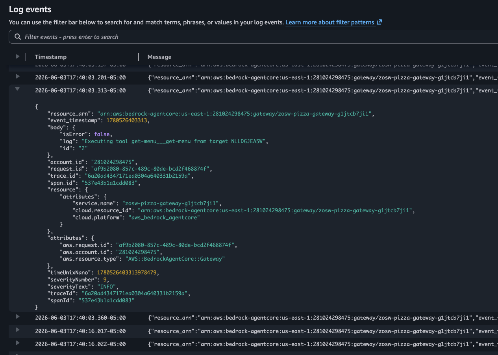
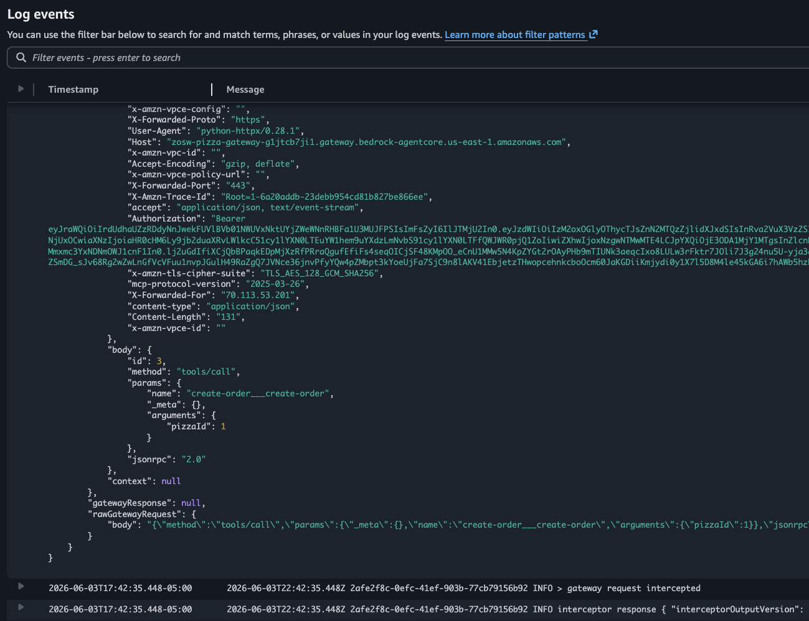
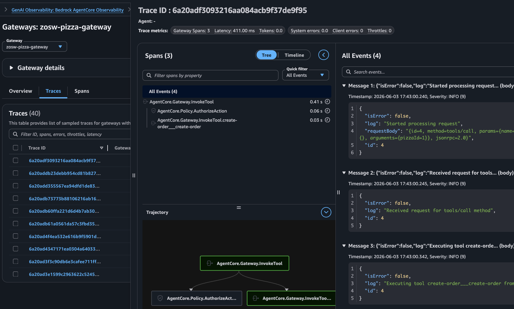

# Module 8: Observability

In the previous module you ran a real agent against your gateway. Now let's look at what actually happened under the hood. This module walks you through the logs, metrics, and traces that are already flowing from your deployment.

## Instrumentation

Your gateway is already configured to emit two streams of telemetry to CloudWatch — see `terraform/gateway-observability.tf`:

- **Application logs** — OTEL-formatted records of every action processed by the gateway, written to a CloudWatch Log Group.
- **Traces** — OTEL-formatted traces capturing the full request lifecycle, including JWT validation, Cedar evaluation, interceptor invocation, and target call.

Both are wired up via the CloudWatch Log Delivery API in `terraform/gateway-observability.tf`:

```hcl
# Define log source
resource "aws_cloudwatch_log_delivery_source" "gateway_logs" {
  name         = "${local.project_name}-gateway-logs"
  log_type     = "APPLICATION_LOGS"
  resource_arn = awscc_bedrockagentcore_gateway.pizza_shop.gateway_arn
}

# Define log destinatation
resource "aws_cloudwatch_log_delivery_destination" "gateway_logs" {
  name = "${local.project_name}-gateway-logs-dest"

  delivery_destination_configuration {
    destination_resource_arn = aws_cloudwatch_log_group.gateway.arn
  }

  output_format = "json"
}

# Attach source to destination
resource "aws_cloudwatch_log_delivery" "gateway_logs" {
  delivery_source_name     = aws_cloudwatch_log_delivery_source.gateway_logs.name
  delivery_destination_arn = aws_cloudwatch_log_delivery_destination.gateway_logs.arn
}
```

No extra deployment is needed — both were enabled when you ran `make deploy-infra` in Module 2.

## Step 1: View gateway logs

1. Open [CloudWatch Log](https://console.aws.amazon.com/cloudwatch/home#logsV2:log-groups) in the AWS Console (CloudWatch -> Logs -> Log Management)

1. Find the log group named `/aws/vendedlogs/bedrock-agentcore/gateway/<your-project-name>`.

1. Open the `BedrockAgentCoreGateway_ApplicationLogs` log stream. Each log entry is a OTEL formatted record for one gateway activity

    

## Step 2: View interceptor logs

Your interceptor Lambda (Module 5) writes its own logs to a separate log group.

1. Find the log group named `/aws/lambda/<your-project-name>-interceptor`.

1. Open a recent log stream. You will see the structured log lines emitted by the interceptor for each REQUEST and RESPONSE:

    

## Step 3: View Gateway telemetry

1. In the CloudWatch Dashboard navigate to **GenAI Observability -> Bedrock AgentCore**.

1. Click on the **Gateways** Tab
    
    

1. You will see a list of the gateways you've created during this workshop - there are several since you've re-created gateway multiple times.  

1. Click the gateway with the largest number of Invocations.

1. Open the **Traces** tab, and click on any Trace ID. You will see full details of the trace:

    

## Next step

Head to [Module 9](m09-conclusion.md) for a recap and cleanup instructions.
